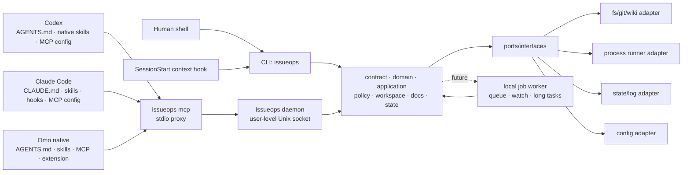

# Hexagonal core, ports, and adapters

> Family index: [`../ARCHITECTURE.md`](../ARCHITECTURE.md). This module owns the
> dependency direction, component boundaries, and the core/port/adapter
> structure. Host-specific integration detail lives in
> [`host-integration.md`](host-integration.md); runtime, state, and process
> topology live in [`runtime.md`](runtime.md).

## Core decision: external harness core, not plugin-only

| 선택지 | 장점 | 단점 | 판단 |
|--------|------|------|------|
| Codex plugin/skill 중심 | Codex 경험에 깊게 통합 가능, 설치 UX가 좋음 | Claude Code/Omo와 공유가 어렵고, plugin API 변화에 core가 종속됨 | 단독 core로 부적절 |
| Claude Code command/hook 중심 | Claude 사용성이 좋고 MCP와 맞음 | Codex/Omo에서 같은 동작을 재사용하기 어렵고, hook에 정책이 흩어짐 | 단독 core로 부적절 |
| 외부 CLI/MCP/worker 중심 | 세 host에서 같은 binary와 schema를 호출, 테스트 가능, 상태 관리 일관 | 초기 설치/IPC/보안 설계 필요 | **채택** |
| Hybrid | 외부 core + host별 얇은 래퍼 | adapter 관리 비용이 있음 | **최종 구조** |

결론: **Go로 작성한 외부 하네스 코어를 만들고, Codex·Claude Code·Omo 설정은 core를 호출하는 얇은 adapter로 둔다.**

## Target architecture

Mermaid는 보조 자료다. 규칙·경계·검증 명령은 아래 텍스트를 우선한다.

### Application / domain / port / host adapter 구조

설치와 host 통합은 SOLID 경계로 나눈다.

- `internal/adapter/install.InstallNative`: 현재 host-neutral 설치 engine. 공통 입력과 skill 목록을 정규화하고 `port.HostInstaller`만 호출한다. 검증된 설치 계약을 유지하면서 신규 use case는 `internal/application/<capability>` vertical을 우선한다.
- `internal/port`: `NativeInstallRequest`, `NativeInstallResult`, `HostInstaller` interface를 정의한다. port는 contract DTO 외의 concrete 내부 구현을 모른다.
- `internal/adapter/codex`: Codex 구현체. user skill symlink, `~/.codex/config.toml` MCP 등록, `~/.codex/hooks.json` lifecycle hook을 기본 갱신한다.
- `internal/adapter/claude`: Claude Code 구현체. user skill symlink, user-scope MCP 등록 경로, `~/.claude/settings.json`의 `SessionStart` context hook만 기본 갱신한다.
- `internal/adapter/omo`: Omo native 구현체. user skill/MCP/extension 설정을 갱신하고 대상 repo에는 명시적 opt-in 없이 파일을 쓰지 않는다.
- `cmd/issueops/issueopsapp`: concrete adapter를 조립하는 유일한 composition root다.
- repo-local `.claude/skills`, `.claude/settings.json`, `.mcp.json`은 적용 대상 repo에 커밋될 수 있으므로 `--project-local` 같은 명시적 opt-in에서만 생성한다.

이 구조에서 새 host를 추가할 때는 domain/application 정책을 복제하지 않고 `port.HostInstaller` 구현체와 composition-root wiring만 추가하는 것이 원칙이다.

## Current package boundaries

| 경로 | 책임 | 금지/주의 |
|------|------|----------|
| `cmd/issueops` | composition root, CLI flag/출력, MCP stdio·JSON-RPC, daemon lifecycle, self-verify/self-augment orchestration | host별 정책과 domain 판정 복제 금지 |
| `internal/contract` | transport/state가 공유하는 versioned DTO와 error vocabulary | 판정 로직과 I/O 금지 |
| `internal/domain` | 순수 규칙, reducer, classifier, CLI/MCP catalog | adapter/cmd, filesystem/process/DB I/O 금지. clock은 기본 주입하며 `auditid` timestamp ID 생성은 현재 명시적 예외 |
| `internal/application` | contract/domain/port를 조합하는 capability use case | concrete adapter와 transport 의존 금지 |
| `internal/port` | 외부 capability interface와 error contract | contract 외 concrete 내부 package 의존 금지 |
| `internal/adapter/inbound` | capability request를 application 호출로 변환 | outbound adapter 직접 의존 금지 |
| `internal/adapter/outbound` | state, SQL, webfetch 등 capability 외부 I/O 구현 | transport 정책과 domain 판정 복제 금지 |
| `internal/domain/toolconformance` | host-neutral schema projection·판정과 gate decision | host argv, credentials, production dispatch 의존 금지 |
| `internal/adapter/toolconformance` | fixture I/O와 behavioral replay 실행 | domain 판정 복제 금지 |
| `internal/adapter/failurecause` | typed causal evidence 수집과 adapter projection | stderr 문자열만으로 model blame 금지 |
| `internal/domain/operationalhealth` | normalized snapshot과 주입된 clock/preserve set을 판정하는 pure classifier | filesystem/process/SQLite I/O, cleanup mutation, host별 정책 금지 |
| `internal/adapter/hostprobe` | Codex/Claude/Omo의 격리된 live probe 실행과 증거 정규화 | 사용자 host 설정·credential DB 수정 금지 |
| `internal/adapter/orca` | 설치된 Orca CLI의 bounded argv/timeout/envelope projection | IssueOps 상태·복구 정책 복제, generic driver registry, 설치 대행 금지 |
| `internal/adapter/operationalhealth` | Git, 전체 IssueOps record/binding, 선택적 Orca inventory를 read-only snapshot으로 수집 | health 판정 복제, state 생성, cleanup mutation 금지 |
| `internal/adapter/codex` | Codex user skill symlink와 user MCP config 설치 | 대상 repo 파일 쓰기 금지 |
| `internal/adapter/claude` | Claude user skill symlink와 user-scope MCP 설정 | 기본 설치에서 `.claude/skills`, `.claude/settings.json`, `.mcp.json` 같은 repo-local 파일 쓰기 금지 |
| `internal/adapter/omo` | Omo user skill/MCP/extension 설정 설치 | 대상 repo 파일 쓰기와 host 공통 정책 복제 금지 |
| `internal/adapter/worker` | local IPC, job lifecycle, daemon state | shell policy 우회 금지 |
| `internal/domain/gates` | unlazy 호환 게이트 ledger의 순수 파서·판정·직렬화(원문 보존) | filesystem/process I/O, policy 실행 금지 |
| `internal/adapter/gates` | 게이트 파일 I/O와 policy 게이트 실행(argv 토큰화→policy→timeout/audit) | raw shell 실행, 크로스 케퍼빌리티 adapter 직접 import 금지(실행기는 composition root 주입) |
| `internal/adapter/issueops/gatesgate` | IssueOps PR readiness에 게이트 ledger 합성(`gates_incomplete:<file>`) | gates adapter 직접 import 금지(함수 변수 주입, loopgate와 동일 구조) |
| `internal/contract/channel` | 세션 간 메시지 채널 DTO(schema v1) | 판정 로직과 I/O 금지 |
| `internal/adapter/channel` | 채널 메시지 append/읽기/대기 원시(issueops state 위) | 크로스 케퍼빌리티 adapter import 금지, 인증 경계 아님 |
| `configs/codex` | Codex plugin/skill 템플릿 | core 로직 금지 |
| `skills` | Codex/Claude/Omo 공용 skill source of truth | host별 복사본을 만들어 drift 유발 금지 |
| `.mcp.json` | 이 하네스 repo의 dogfood/project-local MCP server 설정 | 기본 설치는 user-scope MCP를 사용하므로 대상 repo에 복사 금지 |
| `scripts/install-native.sh` | native skill/MCP 설치 및 갱신 | 사용자 홈 skill symlink만 기본 생성. repo-local 파일은 `--project-local` 명시 때만 생성 |

### Cross-host tool contract boundary

`contract conformance`는 production MCP 의미를 바꾸기 전에 지원되는 live host가 실제로 생성한 raw arguments를 측정한다. 기본 live host는 계속 Codex/Claude이며, Omo native runner는 `--hosts omo`와 explicit `--model omo=provider/model`을 함께 지정한 opt-in에서만 episode를 시작한다. Omo lifecycle module의 canonical 생성은 I/O가 없는 `internal/domain/omolifecycle`가 소유한다. Production preflight는 exact harness path로 생성한 module과 전달된 source의 byte identity만 증명하고, 실제 async JavaScript 실행은 test-only goja proof가 소유한다. 어느 쪽도 live E2E를 뜻하지 않는다. live report는 H0의 `supported|unsupported|unavailable|not-run` 상태를 재사용하며 completed live episode가 없으면 `supported`를 기록하지 않는다. `internal/adapter/mcp`의 capture-only probe는 episode마다 한 tool만 광고하고 production catalog handler를 등록하거나 호출하지 않는다. 임시 config/plugin과 인증 격리는 `internal/adapter/hostprobe`가 소유하고 schema 의미와 판정은 `internal/contract/toolconformance`와 `internal/domain/toolconformance`가 소유한다.

Deterministic baseline과 live evidence는 advertised schema validity와 closed canonical-intent validity를 별도로 기록한다. 재현 gate가 동일 diagnostic signature를 두 번 이상 확인한 경우에만 production advertised schema와 SDK/legacy call entry를 같은 canonical validator로 원자적으로 강화한다. 이 gate가 열리지 않은 상태에서는 benchmark, failure-cause axis, self-verify coverage만 유지하고 production argument semantics는 변경하지 않는다.

### Operational-health boundary

기존 top-level `doctor`가 cross-system operational health의 유일한 공개 표면이다. `internal/adapter/operationalhealth`가 read-only inventory를 정규화하고, `internal/domain/operationalhealth`가 deterministic finding을 만든다. IssueOps stale scan은 같은 cycle-authority 판정만 재사용하되 기존 strong-signal release policy와 locked re-probe를 유지한다. Stability audit는 ownership/residue 규칙을 다시 구현하지 않고 방금 빌드한 binary의 `doctor` 결과를 gate로 소비한다.

### Dependency fitness ratchet

`internal/architecture`는 production import graph의 test-only fitness boundary다. `go list -json ./...`의 direct `Imports`만 정렬된 `importer -> imported` edge로 수집하며, test import와 transitive dependency는 graph에 포함하지 않는다.

- `internal/domain|application/... -> internal/adapter/...|cmd/...`, `internal/adapter/... -> cmd/...`, `internal/port -> contract 외 internal/...`는 baseline 없이 즉시 실패한다. 과거 `core` 규칙도 재도입 방지용으로 유지한다.
- legacy adapter edge는 0이다. `internal/adapter/*`는 composition root(`cmd/issueops/issueopsapp`)에서만 import한다. 예외는 셋뿐이다(`isSharedStorageEngineEdge`) — 같은 capability의 하위 package 사이 edge는 구현 정리이므로 세지 않고(capability는 `internal/adapter/` 다음 경로 요소, `outbound`/`inbound`는 방향 분류이므로 그 다음 요소까지 읽는다), `outbound/sqlstore`는 capability가 아니라 공유 저장 엔진이므로 outbound 어댑터와 `internal/adapter/issueops`가 직접 쓸 수 있으며, `outbound/issueopsrecord`는 `outbound/issueops*` 어댑터만 쓴다. 그 밖의 edge는 `TestProductionGraphHasNoLegacyAdapterEdges`가 막는다.
- baseline을 줄이는 변경은 의도된 architecture 개선으로 같은 review에서만 허용한다. production package 이동이나 runtime wiring은 이 ratchet의 범위가 아니다.
- Issue #499의 maintenance baseline은 기존 package/import graph를 바꾸지 않고 책임별 sibling file로 분해한다. 당시 지목된 7개 비테스트 entry file과 새 sibling은 모두 900줄 미만이며, 이후 예외는 같은 review에서 근거와 검증을 남겨야 한다.

## 현재 hardening 추가 사항

- `internal/port`는 Orca probe/run/worktree/terminal/task/dispatch 역할 interface와 공용 `InstallPlan`을 소유한다. 기존 `OrcaClient` aggregate와 `omo.InstallPlan` alias는 내부 소비자의 type/method-set 호환을 위한 명시적 예외다.
- gates legacy ledger 이름은 persisted schema v1 migration 전까지 유지한다. Orca task payload에는 version 필드가 없으므로 legacy UTC timestamp는 지원 대상 Orca CLI 전부의 `completed_at` readback이 RFC3339Nano임을 확인하고 release contract에서 legacy layout이 제거된 때에만 소스 상수를 올려 닫는다. 시간 경과만으로 호환 경로를 제거하지 않는다.
- Orca/operational-health fan-out은 bounded `errgroup`을 쓰되 indexed error와 partial finding을 보존한다. `quality inspect`의 5-collector fan-out은 모든 read-only 결과를 오류와 함께 끝까지 회수해야 하므로 조기 취소하지 않는 명시적 예외다. 각 collector는 공유 쓰기 없이 버퍼 1 채널에 정확히 한 번 전송해 수신 순서와 무관하게 종료하며, 한 collector 오류도 나머지 진단을 버리지 않는다. channel wait는 append-only immutable record ID를 한 호출 안에서만 기억하며, cross-process writer 때문에 process-global cache나 in-process notification을 authority로 삼지 않는다.
- `internal/domain/cli`가 canonical usage text와 command vocabulary를 소유하고 `cmd/issueops/*cli`가 flag/출력/dispatch를 담당한다.
- `internal/domain/mcp`가 advertised catalog와 dispatch group을 소유하고 `cmd/issueops/mcpcli`가 stdio/JSON-RPC와 handler wiring을 담당한다. `internal/adapter/mcp`는 capture-only conformance probe로 제한한다.
- `issueops contract schema|check`는 CLI/MCP command list, MCP tool name, required response field를 검증하는 DTO compatibility 표면이다.
- `issueops policy audit`는 redacted command-policy decision을 append-only JSONL로 기록하며 command를 실행하지 않는다.
- `issueops worker`는 lifecycle job record(`enqueue/status/list/cancel/cleanup-stuck`)와 policy-gated `run --read-only`(MCP `worker_run_read_only`)를 제공한다. 장기 상주 job daemon은 없다.
