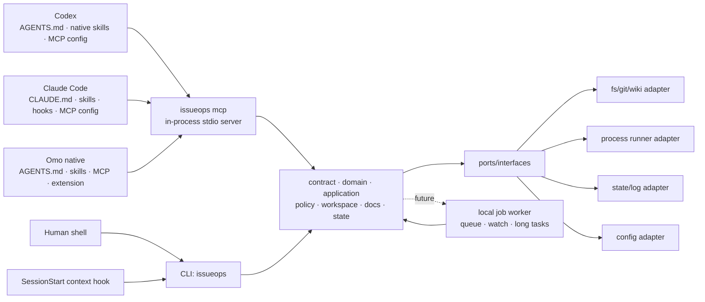

# Hexagonal core, ports, and adapters

> Family index: [`../ARCHITECTURE.md`](../ARCHITECTURE.md). This module owns the
> dependency direction, component boundaries, and the core/port/adapter
> structure. Host-specific integration detail lives in
> [`host-integration.md`](host-integration.md); runtime, state, and process
> topology live in [`runtime.md`](runtime.md).

## Core decision: external harness core, not plugin-only

| 선택지 | 장점 | 단점 | 판단 |
|--------|------|------|------|
| Codex plugin/skill 중심 | Codex 경험에 깊게 통합 가능, 설치 UX가 좋음 | Claude Code/Omo와 공유가 어렵고, plugin API 변화에 core가 종속됨 | 단독 core로 부적절 |
| Claude Code command/hook 중심 | Claude 사용성이 좋고 MCP와 맞음 | Codex/Omo에서 같은 동작을 재사용하기 어렵고, hook에 정책이 흩어짐 | 단독 core로 부적절 |
| 외부 CLI/MCP/worker 중심 | 세 host에서 같은 binary와 schema를 호출, 테스트 가능, 상태 관리 일관 | 초기 설치/IPC/보안 설계 필요 | **채택** |
| Hybrid | 외부 core + host별 얇은 래퍼 | adapter 관리 비용이 있음 | **최종 구조** |

결론: **Go로 작성한 외부 하네스 코어를 만들고, Codex·Claude Code·Omo 설정은 core를 호출하는 얇은 adapter로 둔다.**

## Target architecture

```mermaid
flowchart LR
    Codex["Codex<br/>AGENTS.md · native skills · MCP config"] --> MCP["issueops mcp<br/>in-process stdio server"]
    Claude["Claude Code<br/>CLAUDE.md · skills · hooks · MCP config"] --> MCP
    Omo["Omo native<br/>AGENTS.md · skills · MCP · extension"] --> MCP
    Human["Human shell"] --> CLI["CLI: issueops"]
    Hook["SessionStart context hook"] --> CLI

    MCP --> Core["contract · domain · application<br/>policy · workspace · docs · state"]
    CLI --> Core
    Core --> Ports["ports/interfaces"]
    Ports --> FS["fs/git/wiki adapter"]
    Ports --> Proc["process runner adapter"]
    Ports --> State["state/log adapter"]
    Ports --> Config["config adapter"]

    Core -. future .-> Worker["local job worker<br/>queue · watch · long tasks"]
    Worker --> Core
```

Mermaid는 보조 자료다. 규칙·경계·검증 명령은 아래 텍스트를 우선한다.

### Application / domain / port / host adapter 구조

설치와 host 통합은 SOLID 경계로 나눈다.

- `internal/application/install.Service`: host-neutral 설치 use case. 공통 입력과 skill 목록을 정규화하고 `port.HostInstaller`를 호출한다. root가 `adapter/install.Environment`와 호스트 설치기를 명시적으로 연결한다.
- `internal/port`: `NativeInstallRequest`, `NativeInstallResult`, `HostInstaller` interface를 정의한다. port는 contract DTO 외의 concrete 내부 구현을 모른다.
- `internal/adapter/codex`: Codex 구현체. user skill symlink, `~/.codex/config.toml` MCP 등록, `~/.codex/hooks.json` lifecycle hook을 기본 갱신한다.
- `internal/adapter/claude`: Claude Code 구현체. user skill symlink, user-scope MCP 등록 경로, `~/.claude/settings.json`의 `SessionStart` context hook만 기본 갱신한다.
- `internal/adapter/omo`: Omo native 구현체. user skill/MCP/extension 설정을 갱신하고 대상 repo에는 명시적 opt-in 없이 파일을 쓰지 않는다.
- `cmd/issueops/issueopsapp`: concrete adapter를 조립하는 유일한 composition root다.
- repo-local `.claude/skills`, `.claude/settings.json`, `.mcp.json`은 적용 대상 repo에 커밋될 수 있으므로 `--project-local` 같은 명시적 opt-in에서만 생성한다.

이 구조에서 새 host를 추가할 때는 domain/application 정책을 복제하지 않고 `port.HostInstaller` 구현체와 composition-root wiring만 추가하는 것이 원칙이다.

## Current package boundaries

| 경로 | 책임 | 금지/주의 |
|------|------|----------|
| `cmd/issueops` | composition root, CLI flag/출력, MCP stdio·JSON-RPC, daemon lifecycle, self-verify/self-augment orchestration | host별 정책과 domain 판정 복제 금지 |
| `internal/contract` | transport/state가 공유하는 versioned DTO와 error vocabulary | 판정 로직과 I/O 금지 |
| `internal/domain` | 순수 규칙, reducer, classifier | adapter/cmd, filesystem/process/DB I/O 금지. clock은 기본 주입하며 `auditid` timestamp ID 생성은 현재 명시적 예외 |
| `internal/application` | contract/domain/port를 조합하는 capability use case | concrete adapter와 transport 의존 금지 |
| `internal/port` | 외부 capability interface와 error contract | contract 외 concrete 내부 package 의존 금지 |
| `internal/adapter/inbound` | capability request를 application 호출로 변환 | outbound adapter 직접 의존 금지 |
| `internal/contract/cli` | 정적 command descriptor·usage 원문·actor flag 범례 | 목록 조합·도움말 렌더링·dispatch 금지 |
| `internal/adapter/inbound/catalog/cli` | 명령 목록 조합과 root·lifecycle·child 도움말 렌더링 | root가 도움말을 CLI invocation별 dependency로 전달 |
| `internal/contract/mcp` | 정적 tool/resource descriptor, schema와 dispatch group 타입 | 목록 조합·요청 처리·I/O 금지 |
| `internal/adapter/inbound/catalog/mcp` | 광고 목록·alias dispatch·resource map 조합 | root에서 완성한 catalog를 소비자에게 주입 |
| `internal/adapter/outbound` | state, SQL, webfetch 등 capability 외부 I/O 구현 | transport 정책과 domain 판정 복제 금지 |
| `internal/domain/toolconformance` | host-neutral schema projection·판정과 gate decision | host argv, credentials, production dispatch 의존 금지 |
| `internal/adapter/toolconformance` | fixture I/O와 behavioral replay 실행 | domain 판정 복제 금지 |
| `internal/adapter/failurecause` | typed causal evidence 수집과 adapter projection | stderr 문자열만으로 model blame 금지 |
| `internal/domain/operationalhealth` | normalized snapshot과 주입된 clock/preserve set을 판정하는 pure classifier | filesystem/process/SQLite I/O, cleanup mutation, host별 정책 금지 |
| `internal/adapter/hostprobe` | Codex/Claude/Omo의 격리된 live probe 실행과 증거 정규화 | 사용자 host 설정·credential DB 수정 금지 |
| `internal/adapter/orca` | 설치된 Orca CLI의 bounded argv/timeout/envelope projection | IssueOps 상태·복구 정책 복제, generic driver registry, 설치 대행 금지 |
| `internal/adapter/operationalhealth` | Git, 전체 IssueOps record/binding, 선택적 Orca inventory를 read-only snapshot으로 수집 | health 판정 복제, state 생성, cleanup mutation 금지 |
| `internal/adapter/codex` | Codex user skill symlink와 user MCP config 설치 | 대상 repo 파일 쓰기 금지 |
| `internal/adapter/claude` | Claude user skill symlink와 user-scope MCP 설정 | 기본 설치에서 `.claude/skills`, `.claude/settings.json`, `.mcp.json` 같은 repo-local 파일 쓰기 금지 |
| `internal/adapter/omo` | Omo user skill/MCP/extension 설정 설치 | 대상 repo 파일 쓰기와 host 공통 정책 복제 금지 |
| `internal/adapter/worker` | local IPC, job lifecycle, daemon state | shell policy 우회 금지 |
| `internal/domain/gates` | unlazy 호환 게이트 ledger의 순수 파서·판정·직렬화(원문 보존) | filesystem/process I/O, policy 실행 금지 |
| `internal/adapter/gates` | 게이트 파일 I/O와 policy 게이트 실행(argv 토큰화→policy→timeout/audit) | raw shell 실행, 크로스 케퍼빌리티 adapter 직접 import 금지(실행기는 composition root 주입) |
| `internal/adapter/issueops/gatesgate` | 중복 gate ledger의 파일 관측 | readiness 합성과 판정은 application/domain이 담당 |
| `internal/contract/channel` | 세션 간 메시지 채널 DTO(schema v1) | 판정 로직과 I/O 금지 |
| `internal/adapter/channel` | 채널 메시지 append/읽기/대기 원시(issueops state 위) | 크로스 케퍼빌리티 adapter import 금지, 인증 경계 아님 |
| `configs/codex` | Codex plugin/skill 템플릿 | core 로직 금지 |
| `skills` | Codex/Claude/Omo 공용 skill source of truth | host별 복사본을 만들어 drift 유발 금지 |
| `.mcp.json` | 이 하네스 repo의 dogfood/project-local MCP server 설정 | 기본 설치는 user-scope MCP를 사용하므로 대상 repo에 복사 금지 |
| `scripts/install-native.sh` | native skill/MCP 설치 및 갱신 | 사용자 홈 skill symlink만 기본 생성. repo-local 파일은 `--project-local` 명시 때만 생성 |

### Cross-host tool contract boundary

`cmd/issueops/contractcli.Conformance`는 명령 호출마다 별도 인스턴스로 조립한다. root가 catalog, fixture 로더, replay, live runner와 capture probe를 전달하며 패키지 전역 setter는 사용하지 않는다. baseline과 replay는 해당 인스턴스의 catalog·root를 사용하고 live report도 그 root 아래에 저장한다.

`contract conformance`는 production MCP 의미를 바꾸기 전에 지원되는 live host가 실제로 생성한 raw arguments를 측정한다. 기본 live host는 계속 Codex/Claude이며, Omo native runner는 `--hosts omo`와 explicit `--model omo=provider/model`을 함께 지정한 opt-in에서만 episode를 시작한다. Omo lifecycle module의 canonical 생성은 `internal/adapter/hostprotocol`이 소유한다. composition root가 같은 builder를 installer, activation verifier와 native runner에 주입하며 adapter끼리 직접 의존하지 않는다. Production preflight는 exact harness path로 생성한 module과 전달된 source의 byte identity만 증명하고, 실제 async JavaScript 실행은 test-only goja proof가 소유한다. 어느 쪽도 live E2E를 뜻하지 않는다. live report는 H0의 `supported|unsupported|unavailable|not-run` 상태를 재사용하며 completed live episode가 없으면 `supported`를 기록하지 않는다. `internal/adapter/mcp`의 capture-only probe는 episode마다 한 tool만 광고하고 production catalog handler를 등록하거나 호출하지 않는다. 임시 config/plugin과 인증 격리는 `internal/adapter/hostprobe`가 소유하고 schema 의미와 판정은 `internal/contract/toolconformance`와 `internal/domain/toolconformance`가 소유한다.

Deterministic baseline과 live evidence는 advertised schema validity와 closed canonical-intent validity를 별도로 기록한다. 재현 gate가 동일 diagnostic signature를 두 번 이상 확인한 경우에만 production advertised schema와 SDK/legacy call entry를 같은 canonical validator로 원자적으로 강화한다. 이 gate가 열리지 않은 상태에서는 benchmark, failure-cause axis, self-verify coverage만 유지하고 production argument semantics는 변경하지 않는다.

### Public state and MCP resource boundary

공개 `state write|read|list|prune|doctor|maintain` 명령은 root가 호출별로 조립한 state application을 사용한다. MCP는 `MCPDependencies.State`로 같은 연산을 받으며 직접 호출과 SDK handler가 모두 해당 인스턴스를 사용한다. 저장소 경로와 worker override는 조립 시점에 고정한다. maintenance 대상 탐색과 SQL·파일 관측은 outbound adapter, 유지보수 실행 순서는 application, record 검증과 doctor 판정은 domain이 담당한다.

MCP resource는 `MCPDependencies.Resources`로 저장소 조회·harness 파일 root·문서 조회·정책 요약을 받는다. SDK resource callback과 서버 version도 해당 설정을 사용한다. `project-docs` resource는 기존처럼 현재 작업 디렉터리(`.`)를 대상으로 하며 harness 설치 root와 혼동하지 않는다. 없는 저장소의 read·doctor·maintain은 저장소를 만들지 않고, list는 기존처럼 저장소를 연다. state transport의 전역 setter와 resource 정책 요약 전역 변수는 제거했으며, 다른 capability의 전역 wiring 전환은 T20 후속 범위다.

### Project document boundary

문서 route·read·revise·append는 root가 조립한 `internal/application/projectdocs.Service`를 호출한다. application은 domain의 경로 허용 목록·수정 SHA·추가 문서 규칙을 적용하고 파일 효과를 조율하며, adapter는 읽기·쓰기·문서 렌더링만 담당한다. CLI와 `MCPDependencies.ProjectDocs`는 각각 이 인스턴스를 받고 MCP 직접 호출과 SDK가 같은 service를 사용한다. 기본 대상과 상대 경로 기준 디렉터리는 조립 시 고정하되 명시한 `repo`는 그대로 존중한다. MCP의 빈 `repo`는 기존 `CLAUDE_PROJECT_DIR → PWD → 현재 디렉터리` 우선순위로 조립 시 선택한다. CLI의 기본 `.`과 project-docs resource는 조립 당시 작업 디렉터리를 뜻한다. 기존 문서 실행 facade와 전역 경로·문서 콜백은 제거했으며, inspect 등 다른 capability의 전역 wiring은 후속 범위다.

bootstrap은 별도 `application/projectbootstrap.Service`가 경로 정규화와 문서 생성 순서를 담당한다. root가 문서 렌더링·파일 처리와 `application/lifecycle.Service`를 조립해 CLI와 MCP 인스턴스에 전달한다. lifecycle profile adapter는 고정된 state 경로와 명시적인 경로·Git 관측 함수를 받으며, 기존 전역 setter와 bootstrap/profile 실행 facade는 제거했다. MCP bootstrap은 계속 dry-run 전용이고 CLI는 쓰기·sync·기존 문서 보존 규칙을 domain에 위임한다. doctor도 root에서 같은 lifecycle application을 조립하며, 진단 인스턴스가 사용할 state 경로를 조립 시 고정한다.

### Doctor diagnosis boundary

doctor의 파일·프로세스·HTTP 관측은 adapter가 수행하고, 문서 누락·저장소 내부 runtime 상태·loop 미완료·pipe 용량·MCP 연결 및 FD 압박·native hook 누락·binary 변경 여부는 `internal/domain/doctor`가 판정한다. lifecycle 진단과 전체 health 집계, operational 진단과 중복되는 state artifact의 분류도 같은 domain에 둔다. 관측값에는 읽기 실패와 미관측 상태를 유지하며 판정 함수는 filesystem이나 process를 호출하지 않는다.

`application/doctor.Service`는 기존 순서로 관측값을 모아 domain 결과를 합치고 출력 순서를 정한다. `--static-only`는 pipe·MCP live 관측을 호출하지 않는다. 실제 CLI의 진단 결과, 오류·종료 코드와 저장 파일 변화를 이전 binary와 비교한다. root의 doctor factory는 state·lifecycle·loop 조회를 인스턴스마다 조립한다. CLI의 `basiccli.Doctor`는 application과 경로 정규화, home·harness 경로·version, live 관측 함수를 명시적으로 받는다. adapter의 실행 facade·DTO 재노출·전역 setter와 CLI의 doctor setter는 제거했으며 gateway 관측도 별도 probe 인스턴스를 사용한다. status application도 같은 doctor application을 명시적으로 받으며 집계 책임은 아래 status 경계를 따른다.

### Command policy and audit boundary

`policycli.Command`는 기본 workspace와 `application/policy.Service`, `application/audit.Service`를 명시적으로 받는다. root는 활성 cycle 조회에 사용할 state root와 감사 로그 경로를 조립 시 선택한다. MCP 직접 호출과 SDK도 서버별 `MCPDependencies.Policy`·`Audit`를 사용한다. CLI·MCP의 정책/감사 전역 콜백과 audit adapter의 application 실행 facade는 제거했다.

정책 application은 매 요청마다 workspace의 override를 읽어 domain 판정에 반영하며 파일 손상 경고와 기본 catalog의 거부 동작을 유지한다. audit application은 평가 → 경로 확인 → JSONL append 순서를 담당하고, adapter의 `CommandWriter`는 파일 생성·추가만 수행한다. CLI는 기존 JSON/text·종료 오류를, MCP는 기존 payload/protocol 오류를 유지한다. 서로 다른 state root의 PR 대상 판정과 감사 경로, override 재조회는 실제 root 조립과 두 MCP 호출 경로로 검증한다. 다른 policy 소비자의 adapter 조립 facade와 basic/MCP의 나머지 전역 의존성은 T20 후속 범위다.

### Trace analysis boundary

trace의 실패 요약·progress·guard·문서 갱신 관측을 판정하는 규칙은 `internal/domain/trace`가 소유한다. JSONL에서 문서 갱신 관측을 우선하는 규칙, 실패 횟수 집계, 기본값·추천 명령, 중복 제거·정렬·증거 가림을 순수 입력으로 처리한다. `domain/traceclassification`의 기존 knob·위험도·중복 키 규칙은 재사용한다.

`application/trace.Service`는 입력 확인 → 파일/상태 읽기 → decode → typed evidence 원인 분류 → domain 분석 → 응답 변환을 수행한다. `adapter/trace.Source`는 파일·stdin·주입된 상태 조회와 JSON/JSONL 해석만 맡으며 전역 state/classifier 콜백과 분석 실행 facade는 제거했다. root는 상태 경로를 고정한 source를 조립한다. basic CLI의 명령 인스턴스 전환과 수동 인계 기록의 권한 판정 이전은 별도 후속 작업이다.

기존 fallback·warning·빈 배열·민감정보 가림·명시한 rerun 명령은 유지한다. 기본 추천 명령은 현재 lifecycle·guard·policy·contractgolden 테스트 경로를 사용하며 네 명령을 실제 실행해 검증한다.

### Verify-work boundary

`verify-work`의 JSON DTO는 `internal/contract/verifywork`, 증거별 성공·실패·생략 상태와 전체 판정·추천 명령 규칙은 `internal/domain/verifywork`가 소유한다. `application/verifywork.Service`는 Git status → preflight → guard → 선택한 read-only 명령 → 프로젝트 신호 조회 순서로 관측한 뒤 domain을 호출한다. Git 오류가 있어도 후속 검사를 수행하며 오류 문구·stdout의 끝 개행·빈 배열을 보존한다.

root가 실제 preflight·guard application과 정책 실행기, Git·프로젝트 신호 adapter를 조립해 CLI에 전달한다. CLI는 flag 해석·출력·실패 종료만 담당한다. verify-work의 전역 콜백, CLI DTO 별칭과 결과 builder는 제거했다. 상대 경로와 정책 파일의 매 평가 재조회는 기존 동작을 유지한다.

### Status aggregation and inspect boundary

`internal/contract/status`가 전체 status 응답을, `internal/domain/status`가 관측 성공 여부·경고 순서·self-verify 기록 선택과 daemon admission 관측 조건을 소유한다. 전체 성공은 doctor의 `Healthy`가 아닌 `OK`와 state·worker의 `OK`, 조회 오류 여부로 판정한다. self-verify는 입력 목록에서 처음 일치한 prefix 기록을 선택하며 최신 시각이나 `self-verify-latest` 키를 우선하지 않는다.

`application/status.Service`는 inspect → daemon → doctor → state → worker 순서로 조회하며 오류가 있어도 뒤의 조회를 수행한다. root는 home·harness 경로, state·worker application과 inspect 관측 함수를 조립하고 CLI는 flag·출력만 담당한다. status CLI의 전역 setter·state 콜백·결과 builder·DTO 별칭은 제거했다. `adapter/inspect.Observer`는 문서 조회 함수를 인스턴스로 받아 파일 관측을 수행한다. daemon 조회도 root에서 고정한 reader를 받는다. 다른 basic/MCP 진입점의 전역 연결은 후속 이전 대상이다.

### Worker runtime boundary

worker의 enqueue·read·list·cancel·read-only 실행·stuck 정리는 root가 조립한 `application/worker.Service`를 사용한다. CLI의 `workercli.Command`와 MCP의 직접 호출·SDK handler는 같은 인스턴스를 받으며 status도 worker application을 명시적으로 전달받는다. 전역 저장소·명령 실행 콜백과 adapter의 실행 facade는 제거했다.

adapter의 `Store`는 조립 시 고정한 경로로 SQL·파일·프로세스 관측을 수행한다. 상대 state 경로는 기존 응답과 오류 메시지에 유지하고, 실제 파일 접근 경로는 작업 디렉터리가 바뀌어도 고정한다. application은 기존처럼 읽을 수 없는 작업을 목록에서 제외하고 생성 시각 내림차순으로 정렬하며 queue 집계는 domain이 판정한다. 읽기·수정·쓰기 전체의 SQL span 잠금과 명령 실행 중 잠금 해제, 취소 및 dead PID 재확인은 유지한다. 기본 read·list의 저장소 생성 동작도 기존 계약을 따른다.

### Daemon lifecycle decision boundary

daemon의 준비 완료·시작 차단·종료 허용과 OS 프로세스 신원 비교는 `internal/domain/daemon`이 판정한다. 프로세스 시작 시각 비교는 관측한 시간대를 명시적으로 받아 기존 로케일 형식과 소수 초 정밀도를 보존한다. Linux처럼 실행 파일 경로가 안정된 관측에서만 경로 불일치를 다른 프로세스의 증거로 쓰며, Darwin의 symlink 변경에 따른 경로 차이는 시작 시각·file/socket 신원 확인과 함께 처리한다.

`application/daemon.Reader`는 instance 파일·socket·OS 관측 순서를, `Starter`와 `Waiter`는 시작 잠금·준비 대기·취소를, `StopCoordinator`와 `Stopper`는 잠금 안에서 종료·재확인·파일 정리 순서를 담당한다. 최초 instance 읽기 실패 후 socket이 응답하면 파일을 다시 읽는 기존 시작 경쟁 처리를 유지한다. TERM 전과 강제 종료 직전에 OS 신원을 다시 확인하고, 강제 종료 직전 신원 조회가 실패하면 생존 여부를 재확인해 이미 종료한 프로세스를 오인하지 않는다. 파일·프로세스·잠금·clock 효과는 명시적으로 받는다.

상태 코드·프로세스 관측·socket 응답 DTO와 private probe 식별자는 `contract/daemon`으로 모았다. `adapter/daemon`은 파일·프로세스·잠금·소켓 관측과 실행을 맡는다. root가 경로·환경변수·연결 한도·유휴 제한을 고정해 application, `daemoncli.Command`, `daemoncli.Server`를 조립한다. 연결 한도와 유휴 제한의 기본값·유효 범위는 domain이 판정한다.

MCP 직접 호출·SDK, doctor, status는 조립 시 고정한 daemon reader를 사용한다. daemon 서버도 MCP 의존성을 한 번 받아 각 연결에 전달하므로 다른 서버의 환경 설정으로 바뀌지 않는다. CLI의 전역 함수 setter·서버 factory·실행 facade·DTO 별칭은 제거했다. 테스트용 callback fixture는 실제 application과 adapter를 호출한다. socket accept, admission 동시성, 첫 바이트 재생, idle deadline은 inbound transport 책임으로 유지한다. 실제 Unix 소켓의 두 서버와 MCP 호출로 경로·연결 한도 분리를 검증한다.

### Update and explicit MCP cleanup boundary

update/bootstrap CLI는 root에서 조립한 `updatecli.Command`로 flag를 해석하고 `application/update.Service`를 호출한다. 설치 성공 뒤의 daemon stop → stale 목록 조회 → 순차 종료는 `DaemonRefresh`와 `StaleDaemons`가 담당한다. dry-run과 설치 실패는 갱신 전에 끝나며, stop 실패 뒤에는 목록을 조회하지 않는다. 현재 프로세스 제외는 `domain/install.MayTerminateDaemon`이 판정한다.

`adapter/update.Runtime`은 설치 script·installed binary 실행, 파일 조회, 프로세스 목록과 신호를 처리한다. root가 harness 경로·환경·ps 실행 경로·프로세스 신원 관측을 고정하므로 다른 명령이 환경변수나 cwd를 바꿔도 설정이 섞이지 않는다. script는 요청한 root에서 실행한다. 기존 daemon 목록 조회 실패의 빈 목록 처리와 MCP 목록 실패의 오류 반환 차이를 유지한다.

활성 MCP 세션은 설치 후 정리 대상이 아니다. 명시적 `mcp cleanup`만 `application/update.CleanupMCPProxies`를 호출하며, domain의 exact command·parent·플랫폼·신원 판정과 종료 직전 재조회를 유지한다. 전역 callback/setter, 호환 facade, 사용하지 않는 PID-only parser와 설치 후 MCP no-op은 제거했다. 기존 no-op 테스트는 실제 update application 호출에서 MCP 조회·종료가 없음을 검증하도록 바꿨고, 격리된 프로세스의 실제 script·ps fixture로 두 root의 CLI 실행을 확인한다.

### Loop runtime boundary

loop의 생성·시도 기록·종료·status는 root가 조립한 `application/looprun.Service`를 호출한다. CLI와 MCP 직접 호출·SDK는 각 인스턴스에 고정한 저장소 경로와 작업 디렉터리를 사용한다. adapter의 `Store`는 SQL 읽기·쓰기와 기존 span 잠금만 수행하며 전역 저장소 setter와 lifecycle 실행 facade는 제거했다.

PR readiness와 doctor의 loop 조회는 `application/looprun.Reader`가 기존 record만 읽고, `domain/looprun.EvaluateRepoGate`가 같은 repo의 미완료 여부·집계와 읽기 실패 시 차단을 판정한다. 빈 저장소를 조회해도 생성하거나 권한을 고치지 않는다. doctor와 IssueOps readiness는 조립 시 이 reader를 고정한다. CLI의 phase·PR readiness와 MCP의 readiness도 같은 application 구성을 사용하며, loopgate의 전역 조회 함수와 production 조립 패키지는 제거했다.

### Self-verification history boundary

`self-verify history|compare`와 MCP의 같은 도구는 `internal/application/selfaugment.HistoryService`를 호출한다. root는 저장소 경로를 인스턴스에 고정하고 state application과 SQL adapter를 조립한다. CLI에는 History·Compare 함수를, MCP에는 `MCPDependencies.SelfHistory`를 전달한다. MCP 직접 호출과 SDK 서버 모두 해당 인스턴스를 사용하며 history adapter의 전역 저장소 setter나 parent façade를 거치지 않는다. 정렬·보존·비교 판정은 domain, 조회·삭제 순서는 application, flag·출력·프로토콜 오류 변환은 transport가 소유한다.

계획·검증 요약 저장과 기준선 승격도 root가 저장소별로 조립한 `SavePlan`, `SaveSummary`, `PromoteBaseline` application을 호출한다. CLI는 해당 함수를 직접 받고 MCP는 `MCPDependencies.SelfState`로 받는다. 저장 형식과 승격 가능 여부는 domain, 저장·읽기 순서는 application, SQL 접근은 adapter가 담당한다. 기존 `selfworkflow/stateio`의 production 래퍼와 전역 저장소 setter는 제거했다. 계획 생성·후보 내보내기·lesson 저장은 `MCPDependencies.SelfPlanning`과 같은 root 조립 함수를 CLI에서도 사용한다. 계획 root와 상태 저장소는 인스턴스마다 고정하며, 이전 `augmentplan`·`candidateexport`의 production 래퍼와 lesson 저장 전역 setter를 제거했다.

`quality inspect`는 호출별 `qualitycli.Deps`로 collection과 기준선 저장소를 받는다. 수집·기준선 조회/저장 순서는 `internal/application/quality`, schema·ratio 검증과 상태 반영은 domain, 경로 정규화·소스 스캔·coverage 실행은 outbound adapter가 담당한다. 계획 후보를 quality 후보로 변환하는 책임도 application에 두며 서로 다른 domain의 DTO를 직접 참조하지 않는다. CLI는 flag·출력·종료 오류 변환을 담당하고 패키지 전역 root나 collector를 교체하지 않는다.

self-verify 실행은 root가 저장소 경로와 step adapter를 고정해 `application/selfverify.ExecuteLoop`에 연결한다. CLI와 MCP는 같은 application request를 사용하며 MCP는 `MCPDependencies.SelfVerify`로 서버별 실행기를 받는다. 전역 실행 콜백과 production `verifyloop` 중계 패키지는 제거했다. gate 오류는 application의 동일한 error identity로 판별하고, 실패한 검증 결과를 요청에 따라 저장하는 기존 계약을 유지한다.

`cmd/issueops/selfworkflow` 부모 패키지와 `model`, `augmentcatalog`, `summary`, `steps`, `rerun`, `loopresult`는 production 의존 그래프에서 제거했다. 계약 필드 목록은 `domain/selfverify.ContractValue`, 후보 선택은 `domain/selfaugment.SelectedCandidateID`를 직접 사용한다. 기존 테스트는 각 패키지의 테스트 전용 구성과 정식 contract/domain/application 참조로 유지하며, runtime 호환 별칭이나 전역 catalog setter는 남기지 않는다. CLI의 flag·환경변수 우선순위와 progress·LLM prompt 출력은 해당 inbound adapter에 둔다.

### Operational-health boundary

기존 top-level `doctor`가 cross-system operational health의 유일한 공개 표면이다. `internal/adapter/operationalhealth`가 read-only inventory를 정규화하고, `internal/domain/operationalhealth`가 deterministic finding을 만든다. IssueOps stale scan은 같은 cycle-authority 판정만 재사용하되 기존 strong-signal release policy와 locked re-probe를 유지한다. Stability audit는 ownership/residue 규칙을 다시 구현하지 않고 방금 빌드한 binary의 `doctor` 결과를 gate로 소비한다.

### Dependency fitness ratchet

`internal/architecture`는 production import graph의 test-only fitness boundary다. `go list -json ./...`의 direct `Imports`만 정렬된 `importer -> imported` edge로 수집하며, test import와 transitive dependency는 graph에 포함하지 않는다.

- `internal/domain|application/... -> internal/adapter/...|cmd/...`, `internal/adapter/... -> cmd/...`, `internal/port -> contract 외 internal/...`는 baseline 없이 즉시 실패한다. 과거 `core` 규칙도 재도입 방지용으로 유지한다.
- legacy adapter edge는 0이다. `internal/adapter/*`는 composition root(`cmd/issueops/issueopsapp`)에서 조립한다. 같은 capability의 하위 package 사이 edge는 구현 정리로 허용한다. capability는 `internal/adapter/` 다음 경로 요소이며, `outbound`/`inbound`이면 그 다음 요소까지 포함한다. `isSharedStorageEngineEdge`는 공유 저장 엔진 `outbound/sqlstore`를 outbound 어댑터와 `internal/adapter/issueops`에만, `outbound/issueopsrecord`를 `outbound/issueops*`에만 허용한다.
- `isProcessLifetimeEdge`는 `outbound/processlease`를 세 명령 실행 패키지(`internal/adapter/issueops`, `internal/adapter/orca`, `internal/adapter/provider/providerutil`)에만 허용한다. 이 도구는 OS 잠금과 자식 프로세스의 파일 디스크립터 상속만 담당하며 프로젝트 내부 패키지를 참조하지 않는다. 잠금 파일은 실행 권한이나 작업 상태를 저장하지 않는다. domain/application/port/contract/inbound의 직접 참조는 금지한다. `TestProcessLifetimePrimitiveHasNarrowConsumers`와 `TestProductionGraphHasNoLegacyAdapterEdges`가 허용 범위를 검사한다.
- baseline을 줄이는 변경은 의도된 architecture 개선으로 같은 review에서만 허용한다. production package 이동이나 runtime wiring은 이 ratchet의 범위가 아니다.
- Issue #499의 maintenance baseline은 기존 package/import graph를 바꾸지 않고 책임별 sibling file로 분해한다. 당시 지목된 7개 비테스트 entry file과 새 sibling은 모두 900줄 미만이며, 이후 예외는 같은 review에서 근거와 검증을 남겨야 한다.

## 현재 hardening 추가 사항

- `internal/port`는 Orca probe/run/worktree/terminal/task/dispatch 역할 interface와 공용 `InstallPlan`을 소유한다. 기존 `OrcaClient` aggregate는 내부 소비자의 type/method-set 호환을 위한 명시적 예외다. 호스트 설치기는 공용 `InstallPlan`을 직접 사용한다.
- gates legacy ledger 이름은 persisted schema v1 migration 전까지 유지한다. Orca task payload에는 version 필드가 없으므로 legacy UTC timestamp는 지원 대상 Orca CLI 전부의 `completed_at` readback이 RFC3339Nano임을 확인하고 release contract에서 legacy layout이 제거된 때에만 소스 상수를 올려 닫는다. 시간 경과만으로 호환 경로를 제거하지 않는다.
- Orca/operational-health fan-out은 bounded `errgroup`을 쓰되 indexed error와 partial finding을 보존한다. `quality inspect`의 5-collector fan-out은 모든 read-only 결과를 오류와 함께 끝까지 회수해야 하므로 조기 취소하지 않는 명시적 예외다. 각 collector는 공유 쓰기 없이 버퍼 1 채널에 정확히 한 번 전송해 수신 순서와 무관하게 종료하며, 한 collector 오류도 나머지 진단을 버리지 않는다. channel wait는 append-only immutable record ID를 한 호출 안에서만 기억하며, cross-process writer 때문에 process-global cache나 in-process notification을 authority로 삼지 않는다.
- `internal/contract/cli`가 command descriptor와 canonical usage 원문을 소유한다. `internal/adapter/inbound/catalog/cli`는 명령 목록과 도움말을 조합하고 root가 `issueopscli.Dependencies`에 lifecycle·child 도움말을 전달한다. `internal/domain/cli`에는 명령 허용 여부와 usage key를 해석하는 순수 규칙만 둔다. `cmd/issueops/*cli`는 flag/출력/dispatch를 담당하며 `contractcli`는 root가 넘긴 CLI/MCP 목록으로 호환성 계약을 만든다.
- `internal/contract/mcp`가 정적 schema와 descriptor를, `internal/adapter/inbound/catalog/mcp`가 목록 조합을 소유한다. root는 `MCPDependencies.Catalog`로 서버마다 완성한 목록을 전달한다. `cmd/issueops/mcpcli`는 주입된 목록으로 광고·입력 검증·dispatch를 수행하며 catalog builder를 직접 import하지 않는다. `internal/adapter/mcp`는 capture-only conformance probe로 제한한다.
- `issueops contract schema|check`는 CLI/MCP command list, MCP tool name, required response field를 검증하는 DTO compatibility 표면이다.
- `issueops policy audit`는 redacted command-policy decision을 append-only JSONL로 기록하며 command를 실행하지 않는다.
- `issueops worker`는 lifecycle job record(`enqueue/status/list/cancel/cleanup-stuck`)와 policy-gated `run --read-only`(MCP `worker_run_read_only`)를 제공한다. 장기 상주 job daemon은 없다.

- 수동 세션 인계의 released direct generation·namespace·launcher·owner claim 거부 규칙과 cmux 인계 ID는 `internal/domain/issueops`가 소유한다. 같은 domain이 확정된 lease와 연결할 인계 증거를 선택하고 owner claim observation을 구성한다. `internal/application/handoffdelivery.Service`는 명시적으로 주입된 record reader와 audit store로 조회·판정·기록을 조율하며, cmux가 전달한 fenced snapshot은 다시 조회하지 않는다. root는 state root를 고정해 서비스를 조립한다. 감사 record DTO는 `internal/contract/audit`에 두고, JSONL·digest·receipt·파일 잠금은 audit adapter가 처리한다. Orca 인계의 요청 ID 일치·복구 후보·재전송·응답 유실·관측 기록 구성 규칙도 같은 domain이 소유한다. `handoffdelivery.Provisioner`는 감사 기록 조회·판정·외부 호출·기록 순서를 조율하며, 감사 append 실패 시 외부 호출을 시작하지 않는다. root는 명시적인 audit store와 provider를 연결하고, 감사 adapter의 ambient read/write 및 fold facade는 제거했다. UUID 형식 검사는 공용 contract에 두며, cmux 조율과 다른 진입점의 전역 의존성 제거는 T20에서 계속 추적한다.

- `basiccli.Command`는 docs·inspect·preflight·guard·trace 명령의 의존성을 인스턴스별로 받는다. root가 harness root, 기본 target, guard 작업 디렉터리와 trace·수동 인계 state를 명령 생성 시 고정하며 `basiccli.Configure`와 전역 callback은 사용하지 않는다. guard command의 차단 판정과 block finding 선택은 `domain/guard.BlockingError`, 검사와 오류 조합은 `application/guard.CheckForCommand`, 오류 형식과 직접 타입 판별은 `contract/guard`가 소유한다. docs/inspect의 파일 관측과 목록 선택 책임, 다른 실행 진입점의 잔여 전역 배선은 별도 T01/T20 점검 대상이다.

- channel의 발신·수신 입력 검증, 메시지 구성, cursor 정렬·선택, 채널·개수 제한, 대기 시간과 poll 상한은 `internal/domain/channel`이 소유한다. `application/channel.Service`는 저장소 조회·쓰기·시계·대기를 조율하고, 한 번의 수신 대기 안에서 성공적으로 읽은 immutable ID만 기억한다. 읽기 실패는 다음 poll에서 재시도하며 이 관측 집합을 다른 호출과 공유하지 않는다. root는 명시적인 state root·SQL 연산·시계를 가진 `adapter/channel.Store`로 CLI와 `MCPDependencies.Channel`을 구성한다. MCP의 직접 호출과 SDK transport 모두 같은 서버별 서비스를 사용하며, channel의 전역 callback과 Send/Recv 조립 facade는 제거했다.

- gates의 초기 입력·파일명·원장 형식, 실행 여부·결과 반영·집계, abandon 가능 여부와 이슈 폴더 정렬은 `internal/domain/gates`가 소유한다. `application/gates.Service`는 파일 조회·쓰기 순서를, `CommandRunner`는 정책 평가 후 허용된 명령만 실행하는 순서를 조율한다. root는 파일·시계 adapter와 정책 서비스를 명시적으로 연결해 CLI와 `MCPDependencies.Gates`에 전달한다. MCP 직접 호출·SDK 모두 서버별 서비스를 사용하며 gates의 전역 callback과 runtime 조립 facade는 제거했다. 파일 모드, 기존 파일 거부 우선순위, 원장 문구와 저장 경로 호환 계약은 유지한다. PR readiness는 `application/issueopscycle.GateService`가 관측을 조율하고, 연결 이슈 번호는 기존 URL 해석을 소유한 `domain/issueopsremote`가 선택하고, 중복 원장 차단·PR 진입 여부·readiness 병합은 `domain/issueops`가 판정한다. gatesgate adapter에는 파일 관측만 남겼으며, 다른 진입점의 잔여 전역 의존성 제거는 후속 범위다.

- MCP 서버는 `MCPDependencies`로 검사·preflight·스킬 목록·commit 제안·lint 진단·웹 조회·실행 의존성을 받는다. root는 기본 대상과 harness 경로, 버전, inspector, execution state root를 생성 시 고정하며 직접 호출·SDK가 같은 구성을 사용한다. 문서 도구와 resource는 `Resources`의 동일한 reader/index 설정을 공유한다. MCP의 전역 함수 setter와 실행 fallback, 사용하지 않는 switch/base callback은 제거했다. execution의 실제 application 연결과 native 계보 관측을 유지하며 transport의 요청 context를 전달한다. commit/lint adapter는 명시적으로 받은 경로 정규화와 Git/process 실행만 담당하고 CLI·MCP가 application 서비스를 주입한다. 빈 diff 판정과 명령 존재·실패 로그 tail 규칙은 각 domain, prompt 조합은 application이 소유한다. webfetch 내부 조립 facade와 docs/inspect의 의미적 책임 점검은 후속 범위다.

- IssueOps lifecycle CLI는 `Dependencies.Runtime`과 `Gates`를 명령 인스턴스에 보관한다. root가 state root를 고정한 runtime과 loop reader를 연결하고, actor flag는 해당 인스턴스의 프로세스 계보 관측 함수를 사용한다. 전역 runtime·PR gate setter와 빈 의존성으로 재진입하던 dispatch wrapper는 제거했다. 생성 명령의 provenance·실제 cwd 검사는 dispatch 전에 유지하며 strict readiness의 record 조회 → 기본 판정 → strict 판정 순서도 보존한다. CLI execution도 명령별 runner와 프로세스 관측 함수를 사용한다. cleanup·remote 등 다른 하위 capability의 전역 의존성은 T20 후속 대상이다.

- execution CLI의 `Deps.Runtime`은 액션 실행·프로세스 계보 관측·sync-base·switch-mode 함수를 명시적으로 받는다. root는 이 구성과 cmux 인계 핸들러를 `issueOpsCLIDependencies`에서 연결한다. 전역 runner setter, 중복 state-root 필드, cmux·sync-base fallback과 테스트 전용 production callback은 제거했다. 명시적 actor flag와 현재 native session 관측은 같은 인스턴스의 ancestry 함수를 사용하며, claim token·generation·부분 actor flag 거부와 sync-base 쓰기 전 실제 cwd 확인은 유지한다. runner가 없으면 외부 실행 대신 오류를 반환한다. 하위 IssueOps adapter의 잔여 조립 책임은 T20에서 계속 추적한다.

- hook의 문서 조회와 결과 구성은 `application/hookprompt.CatalogService`가 맡고, 문서 목록과 두 가지 출력 형식의 구현은 root가 연결한다. `hookcatalog.Config.BuildCatalog`는 호출별 서비스를 보관하며 root가 기본 저장소 경로를 구성 시 고정한다. 전역 문서 reader·renderer setter와 hook 전용 중복 경로 해석기를 제거했다. 빈 문서 목록은 출력을 구성하지 않는 application 흐름이고, compact/user-view 문구와 host payload 변환은 presentation adapter에 유지한다. 명시적 repo → stdin repo → 기본 경로 우선순위, disabled no-op, SessionStart live-probe 관측과 PostCompact의 사용자 표시 전용 응답은 보존한다.

- API 문서 검사의 root는 `reviewfiles.Files`에 Git 실행기를 연결하고 `application/apidoc.Service`를 CLI `Command`와 `MCPDependencies.APIDoc`에 전달한다. application은 정적 검사 후 리뷰를 실행하며 정적 실패 시 리뷰를 건너뛴다. CLI는 flag·출력을, MCP는 품질 게이트 실패와 I/O 오류의 응답 구분을 담당한다. 파일 모드·리뷰 결과 읽기는 outbound adapter로 옮기고 전역 파일 effect·Git runner·경로 resolver와 runtime 중계 alias를 제거했다. CLI 기본 경로는 구성 시 cwd를 고정하며 host 환경변수로 대체하지 않는다. 명시적 repo는 그대로 전달하고, result 파일은 repo 기준, 명시적 diff·prompt 파일은 프로세스 cwd 기준으로 읽는 기존 계약을 유지한다. staticcheck 중계 패키지는 테스트 전용이며 production은 기존 domain 검사를 직접 사용한다.

- native 설치는 root가 `application/install.Service`와 네 호스트 `Installer` 인스턴스를 직접 구성한다. 각 설치기는 필요한 파일·hook·digest 의존성을 보관하며 같은 인스턴스가 활성화 readback을 수행한다. 전역 host callback·설치 CLI 설정·중복 조립 facade와 사용하지 않는 dependency 필드는 제거했다. `installcli.Command`는 구성 시 고정한 harness/state 경로와 명시적 실행 파일 관측을 사용하고, 준비된 경로 트랜잭션은 적용 시 사용할 symlink 함수를 캡처한다. 기존 명령 파일 채택, host 파일 snapshot, 링크 복구·디렉터리 정리, 단계별 활성화와 upstream 실패의 비치명적 처리는 유지한다. 테스트는 별도의 홈·소스·state 경로에서 네 호스트 설치와 readback, 준비 후 의존성 변경 및 rollback을 검증한다.

- lease inbound의 `ResumeHandler`와 `ReseedHandler`는 application service와 안내 명령 렌더러를 생성자에서 받는다. root가 CLI와 MCP의 공통 실행 핸들러를 구성하며 전역 next-command setter와 초기화 코드는 제거했다. 렌더러가 빠진 구성은 상태 변경 전에 기존 handler-unavailable 오류로 거부한다. 응답의 generation·artifact 전달과 claim token 경로를 노출하지 않는 기존 명령 형식은 유지한다.

- benchmark의 fixture 필수 입력·판정 점수 검증·fixture별 점수 대응과 채점은 `domain/issueopsbenchmark`가 소유한다. `application/issueopsbenchmark.Service`는 fixture 조회 → artifact 구성 → 실행 ID 생성 → 판정 출처 확인 → 점수 병합·집계 → 저장 순서를 조율하고, 판정 오류가 나면 저장하지 않는다. 비교는 baseline을 먼저 읽고, gate는 candidate 파일을 먼저 읽는다. `adapter/issueops/benchmark.Files`와 `Store`에는 파일·stdin·JSON 처리를 두며 root가 저장 경로·stdin·시계·artifact builder를 실행별로 연결한다. CLI는 flag와 출력만 처리하며 전역 benchmark setter, runtime facade와 외부 LLM 호출을 거부하기만 하던 구형 함수는 제거했다. 기존 테스트의 순수 위임 함수와 타입 별칭은 테스트 파일에만 남긴다.

- cleanup·feedback CLI는 `feedbackcleanup.Command`의 연산과 root가 구성한 실행 의존성을 사용한다. root는 상태 경로를 고정하고 정리 application, Orca, provider, orphan 관측을 연결하며 전역 cleanup·orphan·provider·Orca setter를 제거했다. feedback 저장은 root에서 `application/issueopsreview`에 잠금·actor 검증·저장 callback을 연결한다. `operationalhealth.Collector`는 인스턴스별 `IssueOpsReader`와 native process 관측을 받아 doctor와 orphan이 다른 상태 경로의 레코드를 읽지 않도록 한다. 삭제 직전 cwd 조회, 소유권 잠금 후 외부 관측, 실패 시 JSON 출력 및 generation에 결속된 안내 명령은 유지한다.
