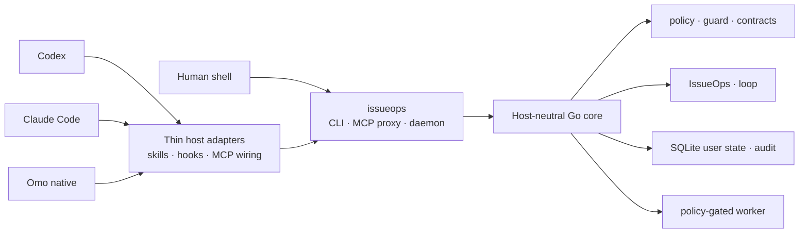

<p align="center">
  
</p>

<h1 align="center">IssueOps</h1>

<p align="center">
  One execution contract for Codex, Claude Code, and Omo native,<br />
  with workflow state and verification evidence kept in a local store outside the host
</p>

<p align="center">
  <a href="README.md">한국어</a>
  ·
  <a href="README.en.md"><strong>English</strong></a>
</p>

> [!IMPORTANT]
> issueops 0.1.0 is an actively developed local tool. The default install
> updates host configuration under your home directory and the command shim in
> `~/.local/bin`. Review the full plan with `./install.sh --dry-run --json`
> before applying it.

## What it solves

Coding agents lose context when the session changes and follow different rules
when the host changes. IssueOps gives a human shell and several agents the same
Go core, the same CLI/MCP contract, the same command policy, and the same skill
source tree. It does not replace a host and it does not approve work on its own.
Instead it binds the issue, branch, plan, execution lease, verification
evidence, and PR/MR into one durable record, so any session that picks the work
up gets the same answer.

| Capability | What it provides |
|---|---|
| Cross-host integration | Codex, Claude Code, and Omo native share one core and one response contract |
| CLI, MCP, and daemon | The human-facing CLI and the agent-facing MCP talk to the same shared daemon |
| IssueOps cycle | Durable state from issue through plan, worktree, implementation, doc reflection, verification, PR/MR, and cleanup |
| Project docs | Creates, routes, and incrementally refreshes `AGENTS.md` and `.issueops/`, and enforces reflection through cycle gates |
| Execution safety | Workspace/cwd boundaries, write/network intent, timeout, redaction, and executable-fence policy |
| Verification and improvement | Contract, quality, self-verify, self-augment, and benchmark evidence in one model |
| Shared skills | One `skills/` tree linked into the user-level skill path of every host |
| UI/UX and browser QA | `ui-ux-craft` plus Aside-based QA skills; Aside is an optional, separately installed tool |

## Quick start

You need Git, Go 1.26.3, and at least one host you plan to use (Codex, Claude Code, or Omo).

```bash
./install.sh --dry-run --json
./install.sh
./bin/issueops inspect --json
./bin/issueops doctor --repo . --json
```

The installer builds the local binary and refreshes the host integration under
your home directory. It writes nothing into a target repository unless you ask
for it explicitly. If `io` is not found after install, open a new shell or
refresh the shell's command cache. `issueops` is the canonical command and `io`
is a short symlink the installer manages. If a different file already carries
one of those names, the installer stops instead of overwriting it.

To refresh an install after updating the checkout, use `io update`. It builds
the current checkout and refreshes the user-level integration, but it never runs
`git pull`.

```bash
git pull --ff-only
io update --dry-run --json
io update --json
io inspect --json
```

`install` accepts `--interactive`, `--project-local`, and
`--path-mode=auto|manual|skip`; `bootstrap` adds `--sync`. `--project-local`
explicitly creates `.mcp.json`, `.omo/mcp.json`, and `.agents/mcp_config.json`,
but skill links always stay in the user's home. After native activation,
`install` and `update` optionally provision the Claude plugins and Git skills
declared in [`configs/upstream.json`](configs/upstream.json). A network failure
in that step is reported but does not fail the install.

## Basic workflow

### Connect project docs to a repository

Review the plan first, then create the `AGENTS.md` routing block and the
`.issueops/` document family. Existing documents are never overwritten wholesale.

```bash
issueops project bootstrap --repo . --dry-run --json
issueops project bootstrap --repo . --json
issueops project route-docs --repo . --task "<task summary>" --json
```

Initial creation belongs to `project-docs-bootstrap`, incremental refresh during
work to `project-docs-update`, and restructuring of oversized documents to
`project-docs-optimize`.

### Check daily health

```bash
io status --json
io doctor --repo . --json
io docs --json
io daemon status --json
```

`doctor` diagnoses install, state, hooks, MCP, daemon, and project docs in one
pass. `status` is the daily summary; `inspect` is the detailed projection of the
install and native integration.

### Start an IssueOps cycle

Whatever stage you are in, ask first. The command is read-only and uses only the
record and local observation.

```bash
issueops next --json
```

```text
stage 3/10 plan.review  cycle io-xxxx  phase plan  lease active(gen 1, self)
missing: devils_advocate_review
next: issueops devils-advocate review --id io-xxxx --reviewer-context subagent ...
exits: pause=issueops execution release --id io-xxxx --generation 1 ... abandon=issueops cleanup abandon --id io-xxxx --reason <TEXT> --preview
```

When no cycle exists, `next` returns `issueops start`.

```bash
issueops start --repo "$PWD" --branch "123-short-description" --json
```

Remote issue, PR/MR creation, and cleanup default to preview or dry-run. External
mutation requires an explicit `--confirm` plus the fingerprint and actor
contract, and an ambiguous result is settled by `reconcile`, which confirms
exactly one outcome instead of retrying.

## The ten stages

The user sees ten stages, each owned by one skill. Only `issueops next` decides
which stage a cycle is in, so every host gets the same answer.

| Stage | Skill | What it does |
|---|---|---|
| 1 Confirm and create the issue | `issueops-create-issue` | Settles the contract through research and blocking questions, then creates the issue |
| 2 Prepare the branch | `issueops-prepare` | Seals the base SHA and links the branch to the issue |
| 3 Read docs, plan, review, hand off | `issueops-plan` | Reads the operating docs, writes the plan, passes review, and picks the execution session automatically |
| 4 Implement | `issueops-implement` | Implements with TDD in the canonical worktree |
| 5 Clean AI slop | `issueops-clean` | Removes residue and seals the change set |
| 6 Reflect into project docs | `issueops-docs` | Records decisions and pitfalls in the operating docs and reseals |
| 7 Verify | `issueops-verify` | Re-runs verification, review, and readiness without touching files |
| 8 Commit and push | `atomic-commit-push` | Commits and pushes the sealed change |
| 9 Publish the PR/MR and complete | `issueops-create-pr`, `issueops-complete` | Creates the draft and seals the completion evidence |
| 10 Clean up after merge | `issueops-cleanup` | Closes the issue and reclaims the worktree and branch |

A normal cycle asks nothing about where to run. Once the branch and worktree are
ready, it checks whether the Orca runtime reports ready: if it does, the work
hands off to a new session in the same worktree, otherwise it continues in the
current one. That branch decides only where the work runs; the original request's
approved scope and endpoint are unchanged, and an explicit instruction to hold or
to use a particular session wins over it. Leaving a cycle from any stage belongs
to `issueops-abandon`. Procedures shared by several stages live in
`issueops-review` (adversarial review), `gates-ledger` (gate ledgers), and
`issueops-remote-write` (the remote write protocol).

The durable phase enum is below. `issue` is a linkage step and `cleanup` is
post-processing after `done`, so neither is part of the enum.

```text
problem → grill → issue → plan → compatibility-review → implement
        → ai-slop-clean → feedback → pr → cleanup
```

## How the operating docs are enforced

IssueOps splits its rules into three layers. Where a rule goes depends on what a
mistake would cost.

| Layer | What lives here | Example |
|---|---|---|
| Context (hook) | Static information a session needs. Reads and writes no state | `SessionStart` injects the `.issueops/` document catalog |
| Procedure (skill) | Ordering and criteria that need judgment. Review catches violations | Read CONSTITUTION, CAUTIONS, and ADR before planning and record them under `## 적용되는 결정과 주의사항` |
| Gate (CLI) | Violations block the next stage. Sealed into the record by fingerprint | The required-section check in `link-plan`, the `project_docs_review` publication gate |

These gates exist in the CLI for the operating docs:

- `issueops link-plan` refuses a plan that lacks any of the four sections
  `## 적용되는 결정과 주의사항`, `## 재사용하는 기존 구현`, `## 성능 영향`, and
  `## 하위 호환성과 side effect`.
- `issueops project-docs-review record` is the stage 6 verdict. `--verdict updated`
  requires every `--doc` path to be in the actual change set, and
  `--verdict no-change` requires at least one `--reviewed-doc` path under
  `.issueops/` that was actually read. The verdict is bound to the change-set
  fingerprint, so a later diff turns it into `project_docs_review_stale` and
  `next` returns the cycle to stage 6.
- The gate applies to every record from implement onward, with or without an
  execution lease.
- `issueops devils-advocate review` accepts at most three unwaived `revise` verdicts
  per plan phase. The fourth is refused, and the error names the exits that are
  actually open: record `stop`, reflect it, then `regress`, or take the round with
  an explicit waiver.

Hooks carry no enforcement. The 2026-08-27 decision removed every legacy
enforcement hook, and a hook that announces the stage was rejected because it
would put stage detection in two places. The rationale is in
[`.issueops/ADR.md`](.issueops/ADR.md).

## Host integrations

The default installer wires three host adapters into the same execution contract.

| Host | Default user-level integration |
|---|---|
| Codex | `~/.codex/skills/`, MCP config, `SessionStart` hook |
| Claude Code | `~/.claude/skills/`, user-scope MCP, `SessionStart` hook |
| Omo native | `~/.omo/agent/skills/`, `~/.omo/mcp.json`, lifecycle extension |

The default install changes only the user's home. An explicit `--project-local`
creates project MCP files but never repo-local skill links or hook registrations.

## Architecture



Five boundaries hold:

1. Core behavior lives in the Go core, never in a host plugin or hook.
2. CLI JSON, MCP responses, and daemon responses keep the same meaning.
3. Host adapters never bypass authentication, command policy, or workspace boundaries.
4. Hooks provide only `SessionStart` project-doc context; they block no tool call and do no work on the agent's behalf.
5. The worker handles lifecycle jobs and policy-gated read-only evidence commands only.

## Command areas

| Area | Representative commands | Role |
|---|---|---|
| Install and update | `install`, `update`, `bootstrap`, `version` | Refresh the binary, skills, hooks, and MCP wiring; check the version |
| Diagnostics | `inspect`, `status`, `doctor`, `docs` | Inspect install, daemon, state, and project docs |
| Safety and quality | `policy`, `guard`, `quality`, `verify-work`, `trace`, `contract`, `api-doc`, `preflight` | Execution policy, change quality, evidence and public contract, pre-commit repository checks |
| Workflow | `issueops`, `loop`, `gates`, `channel` | Durable workflow, completion gate ledgers, cross-session message channels |
| Docs and hooks | `project`, `hook` | Project doc creation, routing, and refresh; the `SessionStart` context hook entry point |
| State and runtime | `state`, `daemon`, `mcp`, `worker` | User state, MCP backend, limited local jobs |
| Improvement and research | `self-verify`, `self-augment`, `web-fetch`, `review-metrics` | Harness verification, improvement candidates, resilient public web fetches, adversarial-review round and verdict metrics |

The full command and MCP tool contract comes from the built binary. The current
checkout's response contract defines 64 CLI commands and 51 MCP tools.

```bash
issueops --help
issueops contract schema --json
issueops contract check --json
```

## Skills

The shared skill source is [`skills/`](skills/). The installer points each
host's user-level skill path at this directory.

- Planning and critique: `implementation-planning`, `requirements-analysis`, `design-review`, `prompt-engineering`
- Execution and verification: `verified-execution`, `issueops-debugging`, `algorithm-optimization`, `database-design`, `code-quality-metrics`
- Research and team work: `web-research`, `meeting-notes`, `slack-delegate`, `sharing-backend-work`
- Git and operations: `git-operations`, `atomic-commit-push`, `rebase-onto-parent`, `gitlab-usecase`
- IssueOps stages: `issueops` (router), `issueops-create-issue`, `issueops-prepare`, `issueops-plan`, `issueops-implement`, `issueops-clean`, `issueops-docs`, `issueops-verify`, `issueops-create-pr`, `issueops-complete`, `issueops-cleanup`, `issueops-abandon`
- IssueOps shared: `issueops-review`, `gates-ledger`, `issueops-remote-write`, `issueops-sync-issue`, `issueops-sync-pr`
- Project docs: `project-bootstrap`, `project-docs-bootstrap`, `project-docs-update`, `project-docs-optimize`
- UI/UX and browser QA: `ui-ux-craft`, `aside-functional-qa`, `aside-visual-qa`, `aside-web-qa`, `read-public-artifact`
- Code review: `pr-review`, `review-agent-feedback`
- Operational improvement: `io-update`, `self-verify`, `self-augment`, `stability-audit`
- Korean writing and diagrams: `fluent-korean`, `diagram-design`

Each skill's contract lives in its `SKILL.md`. The twelve pioneer skills are
verified across primary, boundary, and operational cases; execution receipts and
semantic verdicts are under [`testdata/pioneer-holdouts/`](testdata/pioneer-holdouts/).

## Local data and safety boundaries

- The default install touches only host configuration under your home. A target repository changes only through an explicit bootstrap or a project-local opt-in.
- Runtime state lives in a SQLite store under `~/.local/state/issueops/` by default and can be isolated with `ISSUEOPS_STATE_DIR`.
- Command execution is confined to the workspace root and cwd, with write/network/shell intent, timeout, and redaction managed by policy.
- MCP tool arguments are validated against the public schema; unknown fields and missing or wrongly typed fields are rejected.
- The executable shell fence checks syntax, failure swallowing, destructive commands, dynamic shell, and symlink escapes without running a shell.
- Raw secrets never land in docs, state responses, audit logs, or test fixtures.
- External tools are not dependencies of native install, readiness, or self-verification. Integrations such as Orca are optional adapters; IssueOps stays the durable authority.

## Repository map

```text
cmd/issueops/           composition root and CLI/MCP/daemon/hook entry points
internal/contract/      versioned DTOs shared by transports and stores
internal/domain/        pure rules, reducers, and classifiers with no I/O
internal/application/   use cases composing domain and ports
internal/port/          external capability interfaces and error contracts
internal/adapter/       host, filesystem, process, and DB boundary implementations
internal/architecture/  production import graph fitness tests
configs/                Codex, Claude Code, and Omo native configuration templates
skills/                 skill source shared by every host
.issueops/              architecture, operations, testing, ADR, and other project docs
scripts/                install, release, smoke, and validation scripts
docs/                   supporting documents and assets
openwiki/               OpenWiki quickstart and documentation pages
```

## Verification

Run the minimum gate even for a docs-only change.

```bash
./bin/issueops contract check --json
./bin/issueops docs --json
./bin/issueops inspect --json
go test ./... -count=1
go build -o bin/issueops ./cmd/issueops
git diff --check
```

Add `go test -race ./... -count=1` when Go code or a public contract changed.
The harness quality gate is `self-verify`.

```bash
./bin/issueops self-verify --seed=100 --target-score=95 --llm-eval=false --json
./bin/issueops quality inspect --json
```

In `quality inspect`, `collection_status`, `health_status`, and `gate_status`
report whether collection succeeded, what was observed, and whether the gate
blocks. A collection failure fails closed as `gate=block`; non-blocking debt
such as low coverage stays `report_only`. Per-change standards are in
[`.issueops/TESTING.md`](.issueops/TESTING.md).

## Release and rollback

The current release decision favors tarball and manual archives and holds
Homebrew until the release gate is verified. The release build matrix
cross-builds `darwin/arm64`, `darwin/amd64`, `linux/amd64`, and `linux/arm64`.
Release verification and rollback change local artifacts and the installed
state, so read the
[release reproducibility and rollback criteria](.issueops/operations/release-reproducibility.md)
first. The README carries no destructive rollback commands.

## Troubleshooting

| Symptom | What to check |
|---|---|
| `io` not found after install | Open a new shell or refresh the command cache, and confirm `~/.local/bin` is on PATH |
| Install refused because `io`/`issueops` exists | Expected: the installer never overwrites another file. Find the conflicting path in `--dry-run --json` |
| New MCP tools missing in the host | Reopen the host session after `io update` and inspect the catalog and config with `io inspect --json` |
| Daemon looks unhealthy | Run `io doctor --repo . --json` and `io daemon status --json` |
| `link-plan` rejects with `missing required sections` | Add the four stage 3 section titles verbatim. Merging or renaming them does not pass |
| `next` returns to stage 6 with `project_docs_review_stale` | The diff changed after the verdict. Re-check the docs, reseal, and record the verdict again |
| self-verify looks stuck | Add `--progress=jsonl` to see each step's heartbeat |
| Project docs are stale | Refresh one document at a time with `project-docs-update`; use `project-docs-optimize` for structural problems |

## Project docs

| Document | Purpose |
|---|---|
| [`AGENTS.md`](AGENTS.md) | Repository working rules and verification priority |
| [`.issueops/CONSTITUTION.md`](.issueops/CONSTITUTION.md) | Instruction hierarchy and safety principles |
| [`.issueops/ARCHITECTURE.md`](.issueops/ARCHITECTURE.md) | Component boundaries and responsibilities |
| [`.issueops/AGENT_WORKFLOW.md`](.issueops/AGENT_WORKFLOW.md) | Agent start, work, verification, and completion flow, plus the hook boundary |
| [`.issueops/OPERATIONS.md`](.issueops/OPERATIONS.md) | Install, host, CLI/MCP, and runtime operations map |
| [`.issueops/TESTING.md`](.issueops/TESTING.md) | Tests and verification gates |
| [`.issueops/ADR.md`](.issueops/ADR.md) | Structural decisions, rationale, and rejected alternatives |
| [`openwiki/quickstart.md`](openwiki/quickstart.md) | OpenWiki entry point for code structure and workflows |

Install and operations procedures are split into [install](.issueops/operations/install.md),
[hosts](.issueops/operations/hosts.md), [CLI/MCP](.issueops/operations/cli-and-mcp.md), and
[verification](.issueops/operations/verification.md).

## License

MIT. See [`LICENSE`](LICENSE).
