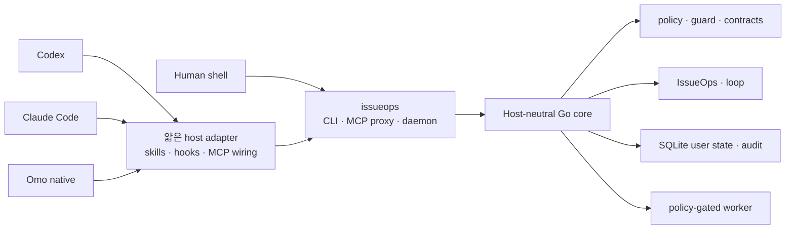

<p align="center">
  
</p>

<h1 align="center">IssueOps</h1>

<p align="center">
  Codex, Claude Code, Omo native를 하나의 실행 계약으로 연결하고,<br />
  작업 상태·안전 경계·검증 근거를 로컬에 보존하는 에이전트 하네스
</p>

<p align="center">
  <a href="README.md"><strong>한국어</strong></a>
  ·
  <a href="README.en.md">English</a>
</p>

> [!IMPORTANT]
> issueops 0.1.0은 활발히 개발 중인 로컬 도구입니다. 기본 설치는 사용자 수준의
> host 설정과 `~/.local/bin` command shim을 갱신합니다. 실제 반영 전에
> `./install.sh --dry-run --json`으로 전체 변경 계획을 확인할 수 있습니다.

## 한눈에 보기

**IssueOps**는 사람의 셸과 여러 코딩 에이전트가 같은 Go 코어, CLI/MCP
계약, 명령 정책, 사용자 상태 저장소, 스킬 원본을 사용하게 합니다. 호스트를
대체하거나 작업을 자동 승인하지 않고, 세션이 바뀌어도 같은 작업 계약을
이어갈 수 있도록 실행 근거를 호스트 밖에 둡니다.

| 기능 | 내용 |
|---|---|
| Cross-host 통합 | Codex, Claude Code, Omo native가 같은 core와 response contract 사용 |
| CLI · MCP · daemon | 사람이 쓰는 CLI와 agent가 쓰는 MCP를 shared daemon에 연결 |
| IssueOps | problem부터 issue, plan, worktree, feedback, PR/MR, cleanup까지 durable state로 기록 |
| Project docs | `AGENTS.md`와 `.issueops/` 문서를 생성·라우팅·점진 갱신 |
| 실행 안전 | workspace/cwd, write/network intent, timeout, redaction, executable fence 정책 |
| 검증과 개선 | contract, quality, self-verify, self-augment, benchmark를 같은 evidence 모델로 제공 |
| 공유 스킬 | `skills/` 하나를 Codex, Claude Code, Omo native의 사용자 경로에 연결 |
| UI/UX 구현 | `ui-ux-craft`가 제품 방향, 컴포넌트 출처별 역할, 접근성, 반응형 상태, 실제 브라우저 QA를 하나의 계약으로 연결 |
| 브라우저 QA | 기능·UI/UX·통합 웹 QA 스킬 제공, Aside는 선행 설치가 필요한 선택적 외부 도구 |

## 빠른 시작

필수 환경:

- Git
- Go 1.26.3
- Codex, Claude Code, Omo 중 사용할 host(선택)

새로 복제한 저장소에서 설치 계획을 확인한 뒤 반영합니다.

```bash
./install.sh --dry-run --json
./install.sh
./bin/issueops inspect --json
./bin/issueops doctor --repo . --json
```

설치기는 로컬 바이너리를 빌드하고 사용자 수준의 호스트 통합을 갱신합니다. 대상 저장소에는 명시적으로 요청하지 않은 호스트 설정을 만들지 않습니다. 설치 후 `io`를 찾지 못하면 새 셸을 열거나 셸의 명령 캐시를 갱신하세요.

하네스의 품질 게이트를 확인하려면:

```bash
./bin/issueops self-verify \
  --seed=100 \
  --target-score=95 \
  --llm-eval=false \
  --json
```

현재 체크아웃의 코드와 설정으로 설치를 갱신할 때:

```bash
git pull --ff-only
io update --dry-run --json
io update --json
io inspect --json
io docs --json
io daemon status --json
```

`issueops`가 정식 명령이며 `io`는 설치기가 관리하는 짧은 심볼릭 링크입니다. 기존 `io` 파일이나 다른 심볼릭 링크가 있으면 덮어쓰지 않고 설치에 실패합니다. `io update`는 현재 체크아웃의 코드를 빌드하고 사용자 수준 통합을 갱신하지만 `git pull`은 실행하지 않습니다.

`io update --dry-run --json`에서는 소스 `root`, Codex·Claude·Omo 호스트별 결과,
새 링크와 제거할 오래된 링크를 먼저 확인합니다. 실제 업데이트가 끝나면
`committed`, `transition_id`, 네이티브 활성화 receipt를 확인하고 새 바이너리로
`inspect`, `docs`, daemon status를 다시 읽습니다.

`install`은 `--interactive`, `--project-local`, `--path-mode=auto|manual|skip`를 지원하고 `bootstrap`은 `--sync`를 추가로 지원합니다. `--project-local`은 `.mcp.json`, `.omo/mcp.json`, `.agents/mcp_config.json`을 명시적으로 생성합니다. 스킬 링크는 항상 user-scope에만 만들며 repo-local로는 만들지 않습니다. Host hook과 Omo lifecycle extension 등록은 계속 사용자 수준에 둡니다. 검증된 기존 harness command file을 인수해야 할 때만 `--adopt-command-file`을 사용합니다.

`install`과 `update`는 native activation 뒤 선택적 upstream provisioning도 수행합니다. [`configs/upstream.json`](configs/upstream.json)에 선언된 missing Claude plugin은 Claude CLI로 설치하고, Git skill은 issueops state cache에 가져와 Claude 사용자 skill 경로에 연결합니다. 이미 있는 항목은 건너뜁니다. upstream/network 실패는 결과에 보고하되 native install을 실패시키지 않습니다. 현재 이 경로는 Claude Code만 대상으로 합니다.

## 기본 사용 흐름

### 저장소에 project docs 연결

먼저 변경 계획을 확인한 뒤 `AGENTS.md` routing block, `.issueops/` 문서
family, repo profile을 생성합니다. 기존 문서는 통째로 덮어쓰지 않습니다.

```bash
issueops project bootstrap --repo . --dry-run --json
issueops project bootstrap --repo . --json
issueops project route-docs --repo . --task "test" --json
```

최초 생성은 `project-docs-bootstrap`, 작업 중 점진 갱신은
`project-docs-update`, 큰 문서의 구조화는 `project-docs-optimize`가 담당합니다.

### 일상 상태 확인

```bash
io status --json
io doctor --repo . --json
io docs --json
io daemon status --json
```

`doctor`가 설치, state, hooks, MCP, daemon, project docs를 함께 진단합니다.
`status`는 일상 확인용 요약이고, `inspect`는 설치·native integration의 상세
projection입니다.

### IssueOps cycle 시작

어느 단계에 있든 먼저 물어봅니다. 이 명령은 읽기 전용이며 record와 로컬 관측만
사용합니다.

```bash
issueops next --json
```

```text
stage 3/10 plan.review  cycle io-xxxx  phase plan  lease active(gen 1, self)
missing: devils_advocate_review
next: issueops devils-advocate review --id io-xxxx --reviewer-context subagent ...
exits: pause=issueops execution release --id io-xxxx --generation 1 ... abandon=issueops cleanup abandon --id io-xxxx --reason <TEXT> --preview takeover=-
```

사이클이 없으면 `next`가 `issueops start`를 돌려줍니다.

```bash
issueops start --repo "$PWD" --branch "123-short-description" --json
```

IssueOps는 아래 사용자 관점 workflow를 하나의 durable record와
generation-fenced `Execution`으로 관리합니다. `issue`는 remote artifact/linkage
단계이고 `cleanup`은 `done` 뒤의 후처리입니다. Durable phase enum은
`problem|grill|plan|compatibility-review|implement|ai-slop-clean|feedback|pr|done`입니다.

```text
problem → grill → issue → plan → compatibility-review → implement
        → ai-slop-clean → feedback → pr → cleanup
```

원격 issue/PR/MR 생성과 cleanup은 preview 또는 dry-run이 기본이며,
외부 변경은 명시적인 `--confirm`과 fingerprint/actor 계약을 요구합니다.

## Host 통합

기본 설치기는 세 가지 공식 호스트 어댑터를 같은 실행 계약에 연결합니다.

| 호스트 | 기본 사용자 수준 통합 |
| --- | --- |
| Codex | `~/.codex/skills/`, MCP config, `SessionStart` hook |
| Claude Code | `~/.claude/skills/`, user-scope MCP, `SessionStart` hook |
| Omo native | `~/.omo/agent/skills/`, `~/.omo/mcp.json`, lifecycle extension |

기본 설치는 사용자/전역 범위만 변경합니다. `--project-local`을 명시하면 Claude/Omo project skill link와 project MCP 파일을 생성하지만 repo-local hook 등록은 만들지 않습니다.

## 아키텍처



다음 경계를 유지합니다.

1. 핵심 동작은 host plugin이나 hook이 아니라 Go core에 둡니다.
2. CLI JSON, MCP response, daemon response는 같은 의미를 유지합니다.
3. host adapter는 인증, command policy, workspace 경계를 우회하지 않습니다.
4. hooks는 `SessionStart` project-doc context만 제공하며 어떤 tool 호출도 차단하지 않고 issue/PR 생성, 파일 편집, 테스트 실행을 대신하지 않습니다.
5. worker는 lifecycle job과 policy-gated read-only evidence command를 다루며 범용 writable shell runner가 아닙니다.

## 주요 명령 영역

| 영역 | 대표 명령 | 역할 |
| --- | --- | --- |
| 설치와 갱신 | `install`, `update`, `bootstrap`, `version` | binary, skills, hooks, MCP wiring 갱신과 버전 확인 |
| 상태 진단 | `inspect`, `status`, `doctor`, `docs` | 설치, daemon, state, project docs 상태 확인 |
| 안전과 품질 | `policy`, `guard`, `quality`, `verify-work`, `trace`, `contract`, `api-doc`, `preflight` | 실행 정책, 변경 품질, evidence와 public contract, 커밋 전 저장소 상태 검사 |
| 작업 흐름 | `issueops`, `loop`, `gates`, `channel` | durable workflow, 완료 게이트 원장, 세션 간 메시지 채널 관리 |
| 문서와 hook | `project`, `hook` | project docs 생성·라우팅·갱신과 host `SessionStart` context hook 진입점 |
| 상태와 실행 | `state`, `daemon`, `mcp`, `worker` | user state, MCP backend, 제한된 local job 관리 |
| 개선과 조사 | `self-verify`, `self-augment`, `web-fetch` | 하네스 검증, 개선 후보 탐색, 실패에 대응하는 공개 웹 조회 |

세부 runtime 표면에서 daemon은 `start|status|stop`을, worker는 `enqueue`, read-only `run`, `status`, `list`, `cleanup-stuck`, `cancel`을 지원합니다. `mcp cleanup`은 dry-run/apply 모드로 오래된 proxy process를 정리합니다.

전체 명령과 MCP 도구 계약은 빌드된 바이너리에서 확인할 수 있습니다.

현재 체크아웃의 response contract 스키마에는 최상위 CLI 명령 29개와 MCP 도구
51개가 정의되어 있습니다.

```bash
issueops --help
issueops contract schema --json
issueops contract check --json
```

## 현재 검증 상태

다음 값은 README에서 별도로 산정한 점수가 아니라 현재 바이너리의 contract와
quality projection입니다.

| 검증 축 | 현재 상태 |
| --- | --- |
| public contract | CLI command 29개, MCP tool 51개 |
| quality collection | `ok` |
| quality health | `needs_attention` |
| quality gate | `report_only` |
| open verification/augmentation candidates | 0 / 0 |
| tracked quality candidates | 0 |
| active audit P1/P2 | 0 |

현재 `needs_attention`은 3개 low-coverage package와 branch complexity 부채를
보고하지만 gate를 차단하지 않습니다. 수집 자체가 실패하면
`collection_status=error`, `health_status=unknown`, `gate_status=block`으로
fail-closed 처리합니다.

현재 값을 다시 확인할 때:

```bash
issueops contract schema --json
issueops quality inspect --json
issueops benchmark run \
  --fixtures testdata/issueops/fixtures \
  --json
```

`quality inspect`의 `collection_status`, `health_status`, `gate_status`는 각각 수집 성공 여부, 관찰된 상태, 차단 여부를 나타냅니다. 수집 실패는 `gate=block`으로 처리하고, low coverage처럼 차단하지 않는 부채는 `report_only`로 남깁니다.

## IssueOps

IssueOps는 대화 속 작업 맥락을 issue, plan, worktree, feedback, verification evidence로 기록해 세션이나 호스트가 바뀌어도 동일한 작업 계약을 유지합니다.

사용자가 보는 단계는 열 개이고, 각 단계에 스킬이 하나씩 있습니다. 단계 판별은
`issueops next`가 소유하므로 어느 에이전트에서 시작해도 같은 답을
얻습니다.

| 단계 | 스킬 | 하는 일 |
|---|---|---|
| 1 이슈 확정·생성 | `issueops-create-issue` | 조사와 blocking 질문으로 계약을 확정하고 이슈를 만든다 |
| 2 브랜치 준비 | `issueops-prepare` | base SHA를 봉인하고 브랜치를 이슈에 연결한다 |
| 3 문서 확인·계획·검토·인계 | `issueops-plan` | 운영 문서를 읽고 계획을 쓰고 검토를 통과한 뒤 구현 세션을 만든다 |
| 4 구현 | `issueops-implement` | canonical worktree에서 TDD로 구현한다 |
| 5 AI slop 정리 | `issueops-clean` | 찌꺼기를 걷어 내고 변경 집합을 봉인한다 |
| 6 프로젝트 문서 반영 | `issueops-docs` | 결정과 함정을 운영 문서에 남기고 재봉인한다 |
| 7 검증 | `issueops-verify` | 파일을 만지지 않고 재검증·리뷰·readiness를 확인한다 |
| 8 커밋·푸시 | `atomic-commit-push` | 봉인된 변경을 커밋하고 푸시한다 |
| 9 PR/MR 발행·완료 | `issueops-create-pr`, `issueops-complete` | draft를 만들고 완료 증거를 봉인한다 |
| 10 머지 후 정리 | `issueops-cleanup` | 이슈를 닫고 워크트리·브랜치를 회수한다 |

어느 단계에서든 빠져나오는 길은 `issueops-abandon`이 소유합니다. 일시 중단은 lease만
놓고, 폐기는 draft PR/MR·이슈·원격 브랜치를 고른 만큼 정리한 뒤 record까지 지웁니다.

여러 단계가 함께 쓰는 절차는 공용 스킬로 분리돼 있습니다. 적대 리뷰는
`issueops-review`, 게이트 원장은 `gates-ledger`, 원격 쓰기 프로토콜은
`issueops-remote-write`가 소유합니다.

durable phase enum은 그대로입니다.

```text
problem → grill → issue → plan → compatibility-review → implement
        → ai-slop-clean → feedback → pr → cleanup
```

`remote issue`, `branch/worktree`, `design review`, `Brooks devil's-advocate review`, `plan link`, `execution decision`은 각 단계에 필요한 durable evidence와 gate로 기록합니다. Fail-closed 판정과 mutation fence는 IssueOps CLI/MCP가 담당하며, hook은 static project-doc context만 주입합니다.

원격 issue 생성은 기본적으로 dry-run입니다. `--confirm` 경로는 provider 호출 전에 project authority, request digest, operation marker를 durable intent로 저장합니다. 호출 결과가 불확실하면 자동 재시도를 막고 `reconcile-issue`에서 같은 project의 단일 live candidate만 연결합니다.

상태 확인은 `issueops status --id "<cycle id>" --json`을
사용합니다. `execution prepare`는 preview로 mode와 readiness fingerprint를
정한 뒤, 반환된 `next_command`로 confirm합니다. `direct`와 `orca`는 실행
adapter일 뿐 IssueOps가 durable authority라는 점은 바뀌지 않습니다.

`create-issue`는 `--confirm`이 없으면 preview만 출력하고 intent를 만들지 않습니다. `reconcile-issue`는 확인된 원격 호출의 결과가 불명확해 durable intent가 남은 경우에만 사용하며, candidate 연결은 별도의 `--confirm`이 필요합니다. Issue/child publication은 [`issueops-create-issue`](skills/issueops-create-issue/SKILL.md), PR/MR publication은 [`issueops-create-pr`](skills/issueops-create-pr/SKILL.md)이 담당합니다. 이미 만든 본문이 사이클보다 낡으면 `sync-issue`/`sync-pr`이 관리 블록을 보존한 채 본문을 교체하며, 이 경로는 [`issueops-sync-issue`](skills/issueops-sync-issue/SKILL.md)와 [`issueops-sync-pr`](skills/issueops-sync-pr/SKILL.md)이 담당하고, 세부 명령과 provider별 제약은 [IssueOps provider 가이드](.issueops/operations/guides/issueops-providers.md)에 정의되어 있습니다.

현재 cycle의 tracked plan/spec/gate와 ignored sealed artifact는 `.issueops/issues/<provider-issue-number>/` 아래에 함께 namespacing합니다. `cleanup finish`는 preview/fingerprint를 다시 확인하고 worktree process와 Orca terminal을 정지한 뒤 worktree·branch·record를 순서대로 정리합니다.

cycle과 remote artifact의 세부 규칙은 [`skills/issueops/SKILL.md`](skills/issueops/SKILL.md)와 [운영 문서](.issueops/OPERATIONS.md)에 정의되어 있습니다.

## 스킬

공용 스킬 원본은 [`skills/`](skills/)입니다. 설치기는 각 호스트의 사용자 수준 스킬 경로가 이 디렉터리를 참조하도록 구성합니다.

- 계획과 비판: `implementation-planning`, `requirements-analysis`, `design-review`, `prompt-engineering`
- 실행과 검증: `verified-execution`, `issueops-debugging`, `algorithm-optimization`, `database-design`, `code-quality-metrics`
- 조사와 팀 협업: `web-research`, `meeting-notes`, `slack-delegate`, `sharing-backend-work`
- Git과 작업 운영: `git-operations`, `atomic-commit-push`, `rebase-onto-parent`, `gitlab-usecase`
- IssueOps 단계: `issueops`(라우터), `issueops-create-issue`, `issueops-prepare`, `issueops-plan`, `issueops-implement`, `issueops-clean`, `issueops-docs`, `issueops-verify`, `issueops-create-pr`, `issueops-complete`, `issueops-cleanup`, `issueops-abandon`
- IssueOps 공용: `issueops-review`, `gates-ledger`, `issueops-remote-write`, `issueops-sync-issue`, `issueops-sync-pr`
- Project docs: `project-bootstrap`, `project-docs-bootstrap`, `project-docs-update`, `project-docs-optimize`
- UI/UX 구현: `ui-ux-craft`
- 브라우저 QA: `aside-functional-qa`, `aside-visual-qa`, `aside-web-qa`, `read-public-artifact`
- 코드 리뷰: `pr-review`, `review-agent-feedback`
- 운영 개선: `io-update`, `self-verify`, `self-augment`, `stability-audit`
- 한국어 작성: `fluent-korean`
- 다이어그램과 시각화: `diagram-design`

각 스킬의 사용 계약은 해당 `SKILL.md`에 정의되어 있습니다.

[`ui-ux-craft`](skills/ui-ux-craft/SKILL.md)는 기존 디자인 시스템을 먼저 확인한
뒤 기반 컴포넌트, 페이지 구조, AI 도메인, 모션, 강조 효과의 역할이 겹치지
않도록 출처를 고릅니다. shadcn/ui, AI SDK Elements, Beautiful UI, beUI,
Transitions.dev, Rare UI, Magic UI, Aceternity UI 같은 후보의 최신 설치법과
라이선스는 [UI source catalog](skills/ui-ux-craft/references/source-catalog.md)의
공식 링크에서 다시 확인하며, 최종 결과는 접근성·반응형 상태·모션 감소 설정과
실제 브라우저 QA까지 통과해야 합니다.

12개 pioneer skill은 primary, boundary, operational case로 나눠 검증합니다. committed case는 재현 입력이고 정답 fixture가 아닙니다. 실행 receipt, case hash, semantic verdict는 [`testdata/pioneer-holdouts/`](testdata/pioneer-holdouts/)에서 확인할 수 있습니다.

## 로컬 데이터와 안전 경계

- 기본 설치는 사용자 수준 호스트 설정만 갱신합니다. 대상 저장소는 명시적 bootstrap이나 project-local opt-in을 사용한 경우에만 변경됩니다.
- runtime state는 기본적으로 `~/.local/state/issueops/` 아래 SQLite store에 저장되며 `ISSUEOPS_STATE_DIR`로 격리할 수 있습니다.
- 명령 실행은 workspace root와 cwd를 제한하고, write/network/shell intent, timeout, redaction을 정책으로 관리합니다.
- MCP tool argument는 공개 schema에 대해 unknown field와 missing/wrong-type field를 거부합니다.
- executable shell fence는 셸을 실행하지 않고 syntax, failure swallowing, destructive command, dynamic shell, symlink 우회를 검사합니다.
- secret 원문은 문서, 상태 응답, audit log, test fixture에 남기지 않습니다.
- 외부 도구는 native install, readiness, self-verification의 의존성이 아닙니다. 선택적 Claude upstream catalog만 activation 뒤 non-fatal provisioning으로 처리합니다.
- Orca supervised execution 같은 연동은 선택적 adapter이며 IssueOps가 계속 durable authority를 가집니다.

## 저장소 구조

```text
cmd/issueops/          composition root와 CLI/MCP/daemon/hook 진입점
internal/contract/    transport와 저장소가 공유하는 versioned DTO
internal/domain/      I/O를 모르는 순수 규칙, reducer, classifier
internal/application/ domain과 port를 조합하는 use case
internal/port/        외부 capability interface와 error contract
internal/adapter/     host, filesystem, process, DB 등 boundary 구현
internal/architecture/ production import graph fitness test
configs/              Codex, Claude Code, Omo native 설정 template
skills/               모든 host가 공유하는 skill 원본
.issueops/       architecture, operations, testing, ADR 등 project docs
scripts/              install, release, smoke, validation script
docs/                 보조 문서와 asset
openwiki/             코드 문서 wiki(OpenWiki)의 quickstart와 문서 페이지
```

## 릴리스와 롤백

issueops는 활발히 개발 중인 `0.1.0` 프로젝트입니다. **현재 배포 결정**은
tarball/manual archive를 우선하고 Homebrew 배포는 release gate 검증이 끝날
때까지 보류하는 것입니다. release build matrix는 `darwin/arm64`,
`darwin/amd64`, `linux/amd64`, `linux/arm64`를 cross-build합니다.

release 검증은 로컬 build artifact를 갱신하고 rollback은 checkout과 설치
상태를 변경하므로, 실행 전
[release reproducibility와 rollback 기준](.issueops/operations/release-reproducibility.md)을
확인하세요. README는 destructive rollback 명령을 제공하지 않습니다.

## 검증

문서만 변경해도 프로젝트의 최소 gate를 실행합니다.

```bash
./bin/issueops contract check --json
./bin/issueops docs --json
./bin/issueops inspect --json
./bin/issueops quality inspect --json
./bin/issueops self-verify \
  --seed=100 \
  --target-score=95 \
  --llm-eval=false \
  --json
go test ./... -count=1
go build -o bin/issueops ./cmd/issueops
git diff --check
```

Go 코드나 public contract를 변경한 경우:

```bash
go test ./... -count=1
go test -race ./... -count=1
go build -o bin/issueops ./cmd/issueops
```

변경 종류별 기준은 [`.issueops/TESTING.md`](.issueops/TESTING.md)를 따릅니다.

## 문제 해결

| 증상 | 확인할 내용 |
|---|---|
| 설치 후 `io`를 찾지 못함 | 새 셸을 열거나 셸 command cache를 갱신하고 `~/.local/bin`이 PATH에 있는지 확인 |
| 기존 `io`/`issueops` 때문에 설치 거부 | installer가 다른 파일을 덮어쓰지 않는 정상 동작; `--dry-run --json`에서 충돌 경로 확인 |
| host에서 새 MCP tool이 보이지 않음 | `io update` 후 host session을 다시 열고 `io inspect --json`으로 catalog/config 상태 확인 |
| daemon 상태가 비정상 | `io doctor --repo . --json`과 `io daemon status --json` 실행 |
| self-verify가 멈춘 것처럼 보임 | `--progress=jsonl`을 추가해 각 step heartbeat 확인 |
| project docs가 오래됨 | `project-docs-update`로 한 문서씩 갱신하고 구조 문제가 있으면 `project-docs-optimize` 사용 |

## 프로젝트 문서

| 문서 | 용도 |
| --- | --- |
| [`AGENTS.md`](AGENTS.md) | 저장소 작업 규칙과 검증 우선순위 |
| [`.issueops/CONSTITUTION.md`](.issueops/CONSTITUTION.md) | instruction hierarchy와 안전 원칙 |
| [`.issueops/ARCHITECTURE.md`](.issueops/ARCHITECTURE.md) | component 경계와 책임 |
| [`.issueops/OPERATIONS.md`](.issueops/OPERATIONS.md) | 설치, host, CLI/MCP, runtime 운영 map |
| [`.issueops/TESTING.md`](.issueops/TESTING.md) | 테스트와 verification gate |
| [`.issueops/operations/quality-dashboard.md`](.issueops/operations/quality-dashboard.md) | quality projection과 pioneer evidence 해석 |
| [`.issueops/ADR.md`](.issueops/ADR.md) | 구조적 결정, 근거, 기각한 대안 |
| [`openwiki/quickstart.md`](openwiki/quickstart.md) | 코드 구조와 워크플로를 안내하는 OpenWiki 입구 |

설치와 운영 절차는 [install](.issueops/operations/install.md), [hosts](.issueops/operations/hosts.md), [CLI/MCP](.issueops/operations/cli-and-mcp.md), [verification](.issueops/operations/verification.md) 문서로 나뉘어 있습니다.

## 라이선스

MIT. [`LICENSE`](LICENSE)를 확인하세요.
