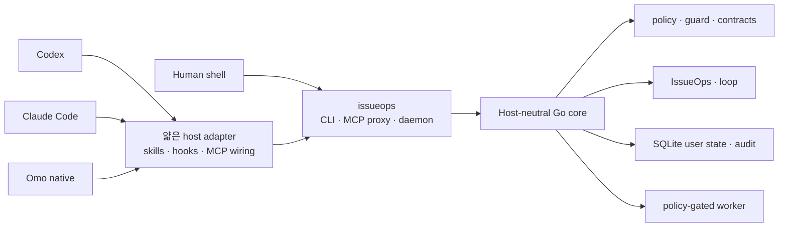

<p align="center">
  
</p>

<h1 align="center">IssueOps</h1>

<p align="center">
  Codex, Claude Code, Omo native가 같은 실행 계약으로 일하게 하고,<br />
  작업 상태와 검증 근거를 호스트 밖 로컬 저장소에 남기는 에이전트 하네스
</p>

<p align="center">
  <a href="README.md"><strong>한국어</strong></a>
  ·
  <a href="README.en.md">English</a>
</p>

> [!IMPORTANT]
> issueops 0.1.0은 활발히 개발 중인 로컬 도구입니다. 기본 설치는 사용자 홈의
> host 설정과 `~/.local/bin` command shim을 갱신합니다. 실제로 반영하기 전에
> `./install.sh --dry-run --json`으로 전체 변경 계획을 먼저 확인하세요.

## 무엇을 해결하는가

코딩 에이전트는 세션이 바뀌면 맥락을 잃고, 호스트가 바뀌면 규칙이 달라집니다.
IssueOps는 사람의 셸과 여러 에이전트가 같은 Go 코어, 같은 CLI/MCP 계약, 같은 명령
정책, 같은 스킬 원본을 쓰게 합니다. 호스트를 대체하거나 작업을 자동으로 승인하지는
않습니다. 대신 이슈, 브랜치, 계획, 실행 lease, 검증 증거, PR/MR을 하나의 durable
record로 묶어 어느 세션에서 이어받아도 같은 답이 나오게 합니다.

| 기능 | 내용 |
|---|---|
| Cross-host 통합 | Codex, Claude Code, Omo native가 하나의 core와 response contract를 공유합니다 |
| CLI · MCP · daemon | 사람이 쓰는 CLI와 에이전트가 쓰는 MCP가 같은 shared daemon에 연결됩니다 |
| IssueOps 사이클 | 이슈부터 계획, worktree, 구현, 문서 반영, 검증, PR/MR, 정리까지 durable state로 기록합니다 |
| Project docs | `AGENTS.md`와 `.issueops/` 운영 문서를 생성·라우팅·점진 갱신하고, 사이클 게이트로 반영을 강제합니다 |
| 실행 안전 | workspace·cwd 경계, write/network intent, timeout, redaction, executable fence 정책을 적용합니다 |
| 검증과 개선 | contract, quality, self-verify, self-augment, benchmark를 같은 evidence 모델로 제공합니다 |
| 공유 스킬 | `skills/` 하나를 세 호스트의 사용자 스킬 경로에 연결합니다 |
| UI/UX와 브라우저 QA | `ui-ux-craft`와 Aside 기반 QA 스킬을 제공합니다. Aside는 별도로 설치하는 선택 도구입니다 |

## 빠른 시작

필요한 환경은 Git, Go 1.26.3, 그리고 사용할 호스트(Codex, Claude Code, Omo 중 하나 이상)입니다.

```bash
./install.sh --dry-run --json
./install.sh
./bin/issueops inspect --json
./bin/issueops doctor --repo . --json
```

설치기는 로컬 바이너리를 빌드하고 사용자 홈의 호스트 통합을 갱신합니다. 대상 저장소에는
명시적으로 요청하지 않은 파일을 만들지 않습니다. 설치 뒤 `io`를 찾지 못하면 새 셸을 열거나
셸의 명령 캐시를 갱신하세요. `issueops`가 정식 명령이고 `io`는 설치기가 관리하는 짧은
심볼릭 링크입니다. 같은 이름의 다른 파일이 이미 있으면 덮어쓰지 않고 설치를 멈춥니다.

체크아웃을 최신으로 맞춘 뒤 설치를 갱신할 때는 `io update`를 씁니다. 이 명령은 현재
체크아웃을 빌드하고 사용자 홈 통합을 갱신할 뿐 `git pull`은 실행하지 않습니다.

```bash
git pull --ff-only
io update --dry-run --json
io update --json
io inspect --json
```

`install`은 `--interactive`, `--project-local`, `--path-mode=auto|manual|skip`를 받고,
`bootstrap`은 `--sync`를 추가로 받습니다. `--project-local`은 `.mcp.json`, `.omo/mcp.json`,
`.agents/mcp_config.json`을 명시적으로 만들지만 스킬 링크는 언제나 사용자 홈에만 둡니다.
`install`과 `update`는 native activation 뒤에 [`configs/upstream.json`](configs/upstream.json)에
선언된 Claude plugin과 Git skill을 선택적으로 준비합니다. 이 단계의 네트워크 실패는 결과에
보고되지만 설치 자체를 실패시키지 않습니다.

## 기본 사용 흐름

### 저장소에 project docs 연결

먼저 변경 계획을 확인한 뒤 `AGENTS.md` routing block과 `.issueops/` 문서 family를 만듭니다.
기존 문서는 통째로 덮어쓰지 않습니다.

```bash
issueops project bootstrap --repo . --dry-run --json
issueops project bootstrap --repo . --json
issueops project route-docs --repo . --task "<작업 요약>" --json
```

최초 생성은 `project-docs-bootstrap`, 작업 중 점진 갱신은 `project-docs-update`,
큰 문서의 구조화는 `project-docs-optimize` 스킬이 맡습니다.

### 일상 상태 확인

```bash
io status --json
io doctor --repo . --json
io docs --json
io daemon status --json
```

`doctor`는 설치, state, hook, MCP, daemon, project docs를 한 번에 진단합니다. `status`는
일상 확인용 요약이고 `inspect`는 설치와 native integration의 상세 projection입니다.

### IssueOps 사이클 시작

어느 단계에 있든 먼저 물어봅니다. 이 명령은 읽기 전용이며 record와 로컬 관측만 사용합니다.

```bash
issueops next --json
```

```text
stage 3/10 plan.review  cycle io-xxxx  phase plan  lease active(gen 1, self)
missing: devils_advocate_review
next: issueops devils-advocate review --id io-xxxx --reviewer-context subagent ...
exits: pause=issueops execution release --id io-xxxx --generation 1 ... abandon=issueops cleanup abandon --id io-xxxx --reason <TEXT> --preview
```

사이클이 없으면 `next`가 `issueops start`를 돌려줍니다.

```bash
issueops start --repo "$PWD" --branch "123-short-description" --json
```

원격 issue, PR/MR 생성과 cleanup은 preview 또는 dry-run이 기본입니다. 외부 변경은 명시적인
`--confirm`과 fingerprint·actor 계약을 요구하고, 결과가 불확실하면 재시도 대신 `reconcile`로
정확히 하나의 결과를 확인합니다.

## IssueOps 10단계

사용자가 보는 단계는 열 개이고, 각 단계에 스킬이 하나씩 있습니다. 어느 단계인지는
`issueops next`만 결정하므로 어느 호스트에서 시작해도 같은 답을 얻습니다.

| 단계 | 스킬 | 하는 일 |
|---|---|---|
| 1 이슈 확정·생성 | `issueops-create-issue` | 조사와 blocking 질문으로 계약을 확정하고 이슈를 만듭니다 |
| 2 브랜치 준비 | `issueops-prepare` | base SHA를 봉인하고 브랜치를 이슈에 연결합니다 |
| 3 문서 확인·계획·검토·인계 | `issueops-plan` | 운영 문서를 읽고 계획을 쓰고 검토를 통과한 뒤 실행 세션을 자동으로 정합니다 |
| 4 구현 | `issueops-implement` | canonical worktree에서 TDD로 구현합니다 |
| 5 AI slop 정리 | `issueops-clean` | 찌꺼기를 걷어 내고 변경 집합을 봉인합니다 |
| 6 프로젝트 문서 반영 | `issueops-docs` | 결정과 함정을 운영 문서에 남기고 재봉인합니다 |
| 7 검증 | `issueops-verify` | 파일을 만지지 않고 재검증·리뷰·readiness를 확인합니다 |
| 8 커밋·푸시 | `atomic-commit-push` | 봉인된 변경을 커밋하고 푸시합니다 |
| 9 PR/MR 발행·완료 | `issueops-create-pr`, `issueops-complete` | draft를 만들고 완료 증거를 봉인합니다 |
| 10 머지 후 정리 | `issueops-cleanup` | 이슈를 닫고 worktree와 브랜치를 회수합니다 |

정상적인 사이클은 실행 방식을 묻지 않습니다. 브랜치와 worktree 준비가 끝나면 Orca
런타임이 ready인지 확인해, ready면 같은 worktree의 새 세션으로 자동 인계하고 없거나
unready면 현재 세션에서 이어갑니다. 이 분기는 실행 위치만 정하며 원래 요청의 승인 범위와
종료점은 그대로입니다. 보류나 특정 세션을 지정한 최신 지시가 이 분기보다 우선합니다. 어느
단계에서든 빠져나오는 길은 `issueops-abandon`이 맡습니다. 여러 단계가 함께 쓰는 절차는
`issueops-review`(적대 리뷰), `gates-ledger`(게이트 원장), `issueops-remote-write`(원격 쓰기)로
분리되어 있습니다.

durable phase enum은 아래와 같습니다. `issue`는 연결 단계이고 `cleanup`은 `done` 뒤의
후처리라서 enum에는 들어가지 않습니다.

```text
problem → grill → issue → plan → compatibility-review → implement
        → ai-slop-clean → feedback → pr → cleanup
```

## 운영 문서는 어떻게 강제되는가

IssueOps는 규칙을 세 층으로 나눕니다. 어느 층에 둘지는 실수했을 때의 비용으로 정합니다.

| 층 | 무엇이 여기에 있나 | 예 |
|---|---|---|
| 컨텍스트(hook) | 세션이 알아야 할 정적 정보만 주입합니다. 상태를 읽거나 바꾸지 않습니다 | `SessionStart`가 `.issueops/` 문서 목록을 넣습니다 |
| 절차(skill) | 판단이 필요한 순서와 기준을 설명합니다. 어기면 리뷰가 지적합니다 | 계획 전에 CONSTITUTION·CAUTIONS·ADR을 읽고 `## 적용되는 결정과 주의사항` 절에 적기 |
| 게이트(CLI) | 어기면 다음 단계로 못 갑니다. record에 fingerprint로 봉인됩니다 | `link-plan`의 필수 절 검사, `project_docs_review` publication 게이트 |

운영 문서에 관해서는 다음 게이트가 CLI에 있습니다.

- `issueops link-plan`은 계획에 `## 적용되는 결정과 주의사항`, `## 재사용하는 기존 구현`,
  `## 성능 영향`, `## 하위 호환성과 side effect` 네 절이 없으면 연결을 거부합니다.
- `issueops project-docs-review record`는 6단계의 판정입니다. `--verdict updated`는 `--doc`
  경로가 실제 변경 집합에 있어야 하고, `--verdict no-change`는 실제로 읽은 `.issueops/` 문서를
  `--reviewed-doc`으로 하나 이상 적어야 통과합니다. 판정은 변경 집합 fingerprint에 묶이므로
  이후 diff가 바뀌면 `project_docs_review_stale`이 되어 `next`가 6단계로 되돌립니다.
- 이 게이트는 실행 lease 유무와 무관하게 implement 이후 모든 record에 걸립니다.
- `issueops devils-advocate review`는 같은 계획 단계에서 waive하지 않은 `revise`를 세
  번까지만 받습니다. 네 번째는 거부하고, 열려 있는 탈출 경로(`stop` 기록 → 반영 →
  `regress`, 또는 waiver)를 오류 문구가 안내합니다.

hook에는 enforcement가 없습니다. 2026-08-27 결정으로 legacy enforcement hook을 모두 삭제했고,
stage를 hook이 알려 주는 방식도 stage 판별이 두 곳에 생긴다는 이유로 기각했습니다. 근거는
[`.issueops/ADR.md`](.issueops/ADR.md)에 있습니다.

## Host 통합

기본 설치기는 세 호스트 어댑터를 같은 실행 계약에 연결합니다.

| 호스트 | 기본 사용자 홈 통합 |
|---|---|
| Codex | `~/.codex/skills/`, MCP config, `SessionStart` hook |
| Claude Code | `~/.claude/skills/`, user-scope MCP, `SessionStart` hook |
| Omo native | `~/.omo/agent/skills/`, `~/.omo/mcp.json`, lifecycle extension |

기본 설치는 사용자 홈만 바꿉니다. `--project-local`을 명시하면 project MCP 파일을 만들지만
repo-local 스킬 링크나 hook 등록은 만들지 않습니다.

## 아키텍처



지키는 경계는 다섯 가지입니다.

1. 핵심 동작은 host plugin이나 hook이 아니라 Go core에 둡니다.
2. CLI JSON, MCP response, daemon response는 같은 의미를 유지합니다.
3. host adapter는 인증, command policy, workspace 경계를 우회하지 않습니다.
4. hook은 `SessionStart` project-doc context만 제공하며 tool 호출을 막거나 작업을 대신하지 않습니다.
5. worker는 lifecycle job과 policy-gated read-only evidence command만 다룹니다.

## 주요 명령 영역

| 영역 | 대표 명령 | 역할 |
|---|---|---|
| 설치와 갱신 | `install`, `update`, `bootstrap`, `version` | binary, skills, hooks, MCP wiring 갱신과 버전 확인 |
| 상태 진단 | `inspect`, `status`, `doctor`, `docs` | 설치, daemon, state, project docs 상태 확인 |
| 안전과 품질 | `policy`, `guard`, `quality`, `verify-work`, `trace`, `contract`, `api-doc`, `preflight` | 실행 정책, 변경 품질, evidence와 public contract, 커밋 전 저장소 상태 검사 |
| 작업 흐름 | `issueops`, `loop`, `gates`, `channel` | durable workflow, 완료 게이트 원장, 세션 간 메시지 채널 |
| 문서와 hook | `project`, `hook` | project docs 생성·라우팅·갱신과 `SessionStart` context hook 진입점 |
| 상태와 실행 | `state`, `daemon`, `mcp`, `worker` | user state, MCP backend, 제한된 local job 관리 |
| 개선과 조사 | `self-verify`, `self-augment`, `web-fetch`, `review-metrics` | 하네스 검증, 개선 후보 탐색, 공개 웹 조회, 적대 리뷰 라운드·판정 지표 |

전체 명령과 MCP 도구 계약은 빌드된 바이너리에서 확인합니다. 현재 체크아웃의 response
contract에는 CLI 명령 64개와 MCP 도구 51개가 정의되어 있습니다.

```bash
issueops --help
issueops contract schema --json
issueops contract check --json
```

## 스킬

공용 스킬 원본은 [`skills/`](skills/)입니다. 설치기는 각 호스트의 사용자 스킬 경로가 이
디렉터리를 참조하도록 구성합니다.

- 계획과 비판: `implementation-planning`, `requirements-analysis`, `design-review`, `prompt-engineering`
- 실행과 검증: `verified-execution`, `issueops-debugging`, `algorithm-optimization`, `database-design`, `code-quality-metrics`
- 조사와 팀 협업: `web-research`, `meeting-notes`, `slack-delegate`, `sharing-backend-work`
- Git과 작업 운영: `git-operations`, `atomic-commit-push`, `rebase-onto-parent`, `gitlab-usecase`
- IssueOps 단계: `issueops`(라우터), `issueops-create-issue`, `issueops-prepare`, `issueops-plan`, `issueops-implement`, `issueops-clean`, `issueops-docs`, `issueops-verify`, `issueops-create-pr`, `issueops-complete`, `issueops-cleanup`, `issueops-abandon`
- IssueOps 공용: `issueops-review`, `gates-ledger`, `issueops-remote-write`, `issueops-sync-issue`, `issueops-sync-pr`
- Project docs: `project-bootstrap`, `project-docs-bootstrap`, `project-docs-update`, `project-docs-optimize`
- UI/UX와 브라우저 QA: `ui-ux-craft`, `aside-functional-qa`, `aside-visual-qa`, `aside-web-qa`, `read-public-artifact`. 앞의 둘은 `next.review.frontend`가 켜진 사이클의 4·7단계에서 호출됩니다
- 코드 리뷰: `pr-review`, `review-agent-feedback`
- 운영 개선: `io-update`, `self-verify`, `self-augment`, `stability-audit`
- 한국어 작성과 시각화: `fluent-korean`, `diagram-design`

각 스킬의 사용 계약은 해당 `SKILL.md`에 있습니다. 12개 pioneer skill은 primary, boundary,
operational case로 나눠 검증하며, 실행 receipt와 semantic verdict는
[`testdata/pioneer-holdouts/`](testdata/pioneer-holdouts/)에 있습니다.

## 로컬 데이터와 안전 경계

- 기본 설치는 사용자 홈의 host 설정만 갱신합니다. 대상 저장소는 명시적 bootstrap이나 project-local opt-in이 있을 때만 바뀝니다.
- runtime state는 기본적으로 `~/.local/state/issueops/` 아래 SQLite store에 저장되며 `ISSUEOPS_STATE_DIR`로 격리할 수 있습니다.
- 명령 실행은 workspace root와 cwd를 제한하고, write/network/shell intent, timeout, redaction을 정책으로 관리합니다.
- MCP tool argument는 공개 schema에 대해 unknown field와 missing/wrong-type field를 거부합니다.
- executable shell fence는 셸을 실행하지 않고 syntax, failure swallowing, destructive command, dynamic shell, symlink 우회를 검사합니다.
- secret 원문은 문서, 상태 응답, audit log, test fixture에 남기지 않습니다.
- 외부 도구는 native install, readiness, self-verification의 의존성이 아닙니다. Orca 같은 연동은 선택적 adapter이며 IssueOps가 durable authority를 유지합니다.

## 저장소 구조

```text
cmd/issueops/           composition root와 CLI/MCP/daemon/hook 진입점
internal/contract/      transport와 저장소가 공유하는 versioned DTO
internal/domain/        I/O를 모르는 순수 규칙, reducer, classifier
internal/application/   domain과 port를 조합하는 use case
internal/port/          외부 capability interface와 error contract
internal/adapter/       host, filesystem, process, DB 등 boundary 구현
internal/architecture/  production import graph fitness test
configs/                Codex, Claude Code, Omo native 설정 template
skills/                 모든 host가 공유하는 skill 원본
.issueops/              architecture, operations, testing, ADR 등 project docs
scripts/                install, release, smoke, validation script
docs/                   보조 문서와 asset
openwiki/               코드 문서 wiki(OpenWiki)의 quickstart와 문서 페이지
```

## 검증

문서만 바꿨어도 최소 gate를 실행합니다.

```bash
./bin/issueops contract check --json
./bin/issueops docs --json
./bin/issueops inspect --json
go test ./... -count=1
go build -o bin/issueops ./cmd/issueops
git diff --check
```

Go 코드나 public contract를 바꿨으면 `go test -race ./... -count=1`을 더합니다. 하네스의
품질 게이트는 `self-verify`로 확인합니다.

```bash
./bin/issueops self-verify --seed=100 --target-score=95 --llm-eval=false --json
./bin/issueops quality inspect --json
```

`quality inspect`의 `collection_status`, `health_status`, `gate_status`는 각각 수집 성공 여부,
관찰된 상태, 차단 여부입니다. 수집 실패는 `gate=block`으로 fail-closed 처리하고, low coverage처럼
차단하지 않는 부채는 `report_only`로 남깁니다. 변경 종류별 기준은
[`.issueops/TESTING.md`](.issueops/TESTING.md)를 따릅니다.

## 릴리스와 롤백

현재 배포 결정은 tarball/manual archive를 우선하고 Homebrew 배포는 release gate 검증이 끝날
때까지 보류하는 것입니다. release build matrix는 `darwin/arm64`, `darwin/amd64`, `linux/amd64`,
`linux/arm64`를 cross-build합니다. release 검증과 rollback은 로컬 artifact와 설치 상태를
바꾸므로 실행 전에 [release reproducibility와 rollback 기준](.issueops/operations/release-reproducibility.md)을
읽으세요. README는 destructive rollback 명령을 싣지 않습니다.

## 문제 해결

| 증상 | 확인할 내용 |
|---|---|
| 설치 후 `io`를 찾지 못함 | 새 셸을 열거나 셸 command cache를 갱신하고 `~/.local/bin`이 PATH에 있는지 확인합니다 |
| 기존 `io`/`issueops` 때문에 설치 거부 | 다른 파일을 덮어쓰지 않는 정상 동작입니다. `--dry-run --json`에서 충돌 경로를 확인합니다 |
| host에서 새 MCP tool이 보이지 않음 | `io update` 뒤 host session을 다시 열고 `io inspect --json`으로 catalog와 config를 확인합니다 |
| daemon 상태가 비정상 | `io doctor --repo . --json`과 `io daemon status --json`을 실행합니다 |
| `link-plan`이 `missing required sections`로 거부됨 | 계획에 3단계의 네 필수 절 제목을 그대로 넣습니다. 제목을 합치거나 바꾸면 통과하지 않습니다 |
| `project_docs_review_stale`로 `next`가 6단계로 되돌림 | 판정 뒤 diff가 바뀐 것입니다. 문서를 다시 대조하고 재봉인한 뒤 판정을 다시 기록합니다 |
| self-verify가 멈춘 것처럼 보임 | `--progress=jsonl`을 추가해 각 step heartbeat를 확인합니다 |
| project docs가 오래됨 | `project-docs-update`로 한 문서씩 갱신하고 구조 문제가 있으면 `project-docs-optimize`를 씁니다 |

## 프로젝트 문서

| 문서 | 용도 |
|---|---|
| [`AGENTS.md`](AGENTS.md) | 저장소 작업 규칙과 검증 우선순위 |
| [`.issueops/CONSTITUTION.md`](.issueops/CONSTITUTION.md) | instruction hierarchy와 안전 원칙 |
| [`.issueops/ARCHITECTURE.md`](.issueops/ARCHITECTURE.md) | component 경계와 책임 |
| [`.issueops/AGENT_WORKFLOW.md`](.issueops/AGENT_WORKFLOW.md) | 에이전트 시작·작업·검증·완료 흐름과 hook 경계 |
| [`.issueops/OPERATIONS.md`](.issueops/OPERATIONS.md) | 설치, host, CLI/MCP, runtime 운영 map |
| [`.issueops/TESTING.md`](.issueops/TESTING.md) | 테스트와 verification gate |
| [`.issueops/ADR.md`](.issueops/ADR.md) | 구조적 결정, 근거, 기각한 대안 |
| [`openwiki/quickstart.md`](openwiki/quickstart.md) | 코드 구조와 워크플로를 안내하는 OpenWiki 입구 |

설치와 운영 절차는 [install](.issueops/operations/install.md), [hosts](.issueops/operations/hosts.md),
[CLI/MCP](.issueops/operations/cli-and-mcp.md), [verification](.issueops/operations/verification.md)
문서로 나뉘어 있습니다.

## 라이선스

MIT. [`LICENSE`](LICENSE)를 확인하세요.
