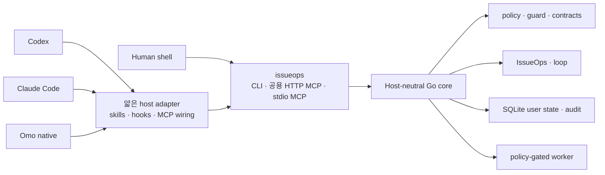

<p align="center">
  
</p>

<h1 align="center">IssueOps</h1>

<p align="center">
  Codex, Claude Code, Omo native가 같은 실행 계약으로 일하게 하고,<br />
  작업 상태와 검증 근거를 호스트 밖 로컬 저장소에 남기는 에이전트 하네스
</p>

<p align="center">
  <a href="README.md"><strong>한국어</strong></a>
  ·
  <a href="README.en.md">English</a>
</p>

IssueOps는 **이슈 → 계획 → 구현 → 검증 → PR/MR → 정리**를 여러 코딩 에이전트가
같은 규칙으로 이어서 수행하도록 돕는 로컬 Go 하네스입니다. Codex, Claude Code,
Omo native는 공통 CLI·MCP·스킬을 사용하고, 작업 상태와 검증 근거는 SQLite에 남깁니다.

[빠른 시작](#빠른-시작) · [첫 작업 시작](#첫-작업-시작) · [모델과 세션 인계](#모델과-세션-인계) ·
[아키텍처](#아키텍처) · [문제 해결](#문제-해결)

## 어떤 작업에 쓰나요?

- **세션을 바꿔도 이어서 작업:** 연결된 이슈·브랜치·worktree·계획과 다음 단계를 조회합니다.
- **검증한 변경만 발행:** 리뷰와 문서 판정을 변경 집합의 fingerprint에 묶어, 수정 뒤에는 다시 검증하게 합니다.
- **중복 실행과 원격 생성 방지:** 실행 권한(lease), 세대 번호, CAS로 변경 주체를 확인하고 응답이 불분명하면 복구 절차로 안내합니다.
- **호스트 간 규칙 공유:** `skills/` 원본과 `.issueops/` 운영 문서를 Codex·Claude Code·Omo에서 함께 사용합니다.

PR/MR 발행 완료, 머지, 정리는 별도 단계입니다. 에이전트는 사용자가 요청한 범위까지
진행하며, 발행만 요청한 작업을 임의로 머지하거나 삭제하지 않습니다.

## 빠른 시작

필수 환경은 **Git, Go 1.26.6, 사용할 코딩 호스트 하나 이상**입니다.
GitHub·GitLab에 이슈나 PR/MR을 쓰려면 해당 provider의 CLI(`gh`·`glab`)와 인증도 준비합니다.
Orca와 브라우저 QA용 Aside는 선택 연동이며 별도로 설치합니다.

```bash
git clone https://github.com/m16khb-org/issueops.git
cd issueops

./install.sh --dry-run --json
./install.sh

./bin/issueops inspect --json
./bin/issueops doctor --repo . --json
```

> [!IMPORTANT]
> 현재 버전은 0.1.0입니다. 설치는 사용자 홈의 호스트 설정·스킬 링크와
> `~/.local/bin` 명령을 갱신합니다. 먼저 dry-run의 대상 경로를 확인하세요.
> `install.sh`는 dry-run에서도 로컬 바이너리를 빌드하고, 호스트 설정 쓰기만 생략합니다.

설치 뒤에는 정식 명령 `issueops` 또는 짧은 별칭 `io`를 사용합니다. 기존의 다른
`io`·`issueops` 파일을 덮어쓰지 않으며 충돌 시 설치를 중단합니다.

### 어디에 설치되나요?

| 대상 | 기본 위치와 역할 |
|---|---|
| Codex | `~/.codex/skills/`, MCP 설정, `SessionStart`·`SubagentStart` hook |
| Claude Code | `~/.claude/skills/`, user-scope MCP, `SessionStart`·`SubagentStart` hook |
| Omo native | `~/.omo/agent/skills/`, `~/.omo/mcp.json`, lifecycle extension |
| MCP 서비스 | macOS LaunchAgent `io.issueops.mcp` 또는 Linux systemd user `issueops-mcp.service`. `http://127.0.0.1:47831/mcp` 하나를 세 호스트가 함께 씁니다 |
| 실행 상태 | `~/.local/state/issueops/` 아래 SQLite 저장소. `ISSUEOPS_STATE_DIR`로 격리 가능 |
| 프로젝트 지식 | 대상 저장소의 `AGENTS.md`·`.issueops/`. 명시적인 project bootstrap으로 생성 |

스킬은 복사하지 않고 이 체크아웃의 `skills/`를 참조합니다. 설치 후에도 체크아웃을 유지하세요.
기본 설치는 대상 프로젝트에 파일을 만들지 않습니다. `--project-local`을 명시하면 project
MCP 설정을 추가하지만 스킬 링크는 사용자 홈에만 둡니다. agy용 통합도 설치기에 포함되어 있습니다.

macOS와 Linux의 기본 MCP 연결은 공용 HTTP 서비스입니다(`--mcp-transport=http`). 설치기는
`~/.local/state/issueops/mcp-http/bearer`에 인증 토큰을 만들고, 세 호스트 설정의 issueops 항목만
URL과 `Authorization` 헤더로 바꾼 뒤 파일 권한을 0600으로 둡니다. 예전처럼 호스트 세션마다
`issueops mcp`를 띄우려면 `./install.sh --mcp-transport=stdio`로 설치합니다. 서비스 상태는
`io mcp service status --json`으로 확인합니다. HTTP로 workspace 도구를 부르는 세션은 먼저
`io mcp authorize --workspace-root <repo> ...`로 권한 파일을 발급받고, 호출할 때 그 경로를
`authority_file`로 넘깁니다. 같은 OS 사용자의 프로세스는 이 파일들을 읽을 수 있으므로 신뢰 경계는
OS 사용자입니다.

설치 옵션과 선택적 upstream plugin·skill 준비는 [설치 가이드](.issueops/operations/install.md)를 참고하세요.

### 업데이트

IssueOps 소스 체크아웃에서 실행합니다.

```bash
git pull --ff-only
io update --dry-run --json
io update --json
io inspect --json
```

`io update`는 설치된 명령이 가리키는 IssueOps 체크아웃을 빌드합니다. 실행한 현재 디렉터리를
설치 원본으로 바꾸거나 `git pull`을 대신 실행하지 않습니다. HTTP 설치에서는 `io update`가
MCP 서비스를 멈추고 새 바이너리로 다시 띄운 뒤 `build_id`를 확인합니다. MCP 변경은 호스트가
서버를 다시 연결할 때 적용되므로, 업데이트 후에도 옛 도구가 보이면 MCP를 재연결하세요.

현재 배포 결정은 첫 릴리스에 tarball/manual archive를 우선하고, Homebrew는
재현성 검증과 롤백 기준을 충족한 뒤 도입하는 것입니다. 설치 복구가 필요하면
[릴리스 재현성과 롤백 기준](.issueops/operations/release-reproducibility.md)을 따르세요.

## 첫 작업 시작

### 1. 대상 프로젝트에 운영 문서 연결

작업할 저장소로 이동한 뒤 생성 계획을 확인합니다.

```bash
cd /path/to/your-project
io project bootstrap --repo . --dry-run --json
io project bootstrap --repo . --json
io project route-docs --repo . --task "구현할 작업 요약" --json
```

bootstrap은 `AGENTS.md`의 문서 안내와 `.issueops/` 문서 모음을 준비합니다.
기존 문서를 통째로 덮어쓰지 않습니다. 최초 생성은 `project-docs-bootstrap`, 작업 중
갱신은 `project-docs-update`, 큰 문서의 분리는 `project-docs-optimize` 스킬이 담당합니다.

### 2. 에이전트에 작업 요청

설치된 `issueops` 스킬과 함께 원하는 결과·제약·종료점을 전달합니다. 예를 들면:

> issueops로 로그인 오류를 수정해줘. 만료된 세션에서 오류를 재현하고 테스트를 추가해줘.
> Draft PR을 만드는 데까지 진행해줘.

현재 단계는 `next`로 확인합니다. 이 명령은 읽기 전용입니다.

```bash
io next --json
io list --repo "$PWD" --json
```

사이클이 없으면 `next`가 시작 명령을 안내합니다. 직접 시작하려면:

```bash
io start --repo "$PWD" --branch "123-fix-login" --json
io next --id "반환된-ID" --json
```

`next`의 `missing`, `next_command`, `exits`를 따라 진행합니다. 여러 사이클을 만드는
`--new`는 호출마다 새 ID를 생성하므로 응답이 불분명할 때 반복하지 않습니다.
원격 생성 결과가 불분명할 때도 재시도 대신 `reconcile`로 기존 결과를 확인합니다.

### 3. 단계별로 실행·검증·발행

| 단계 | 스킬 | 결과 |
|---|---|---|
| 1. 이슈 확정·생성 | `issueops-create-issue` | 요구사항·성공 조건을 담은 이슈 |
| 2. 브랜치 준비 | `issueops-prepare` | base SHA와 이슈에 연결된 브랜치 |
| 3. 계획·검토·인계 | `issueops-plan` | 검토한 계획과 실행 worktree·세션 |
| 4. 구현 | `issueops-implement` | 테스트로 확인한 구현 |
| 5. AI slop 정리 | `issueops-slop-clean` | 불필요한 변경을 제거하고 봉인한 diff |
| 6. 문서 반영 | `issueops-docs` | 현재 구현과 일치하는 운영 문서 |
| 7. 검증 | `issueops-verify` | 실행 증거·독립 리뷰·발행 준비 확인 |
| 8. 커밋·푸시 | `atomic-commit-push` | 검증한 변경의 커밋과 원격 브랜치 |
| 9. PR/MR 발행·완료 | `issueops-create-pr`, `issueops-complete` | Draft PR/MR과 완료 증거 |
| 10. 머지 후 정리 | `issueops-cleanup` | 연결 이슈·worktree·브랜치 정리 |

이 표는 사용자용 단계입니다. 내부 저장 상태와의 대응은
[실행 가이드](.issueops/operations/guides/issueops-execution.md)가 설명합니다.
중간에 보류하거나 폐기하려면 `issueops-abandon`을 사용합니다.

release처럼 계속 앞서 나가는 base 브랜치에서 딴 작업 브랜치는 `sync-base` 스킬로
최신 상태에 맞춥니다. 이 스킬은 커밋이 이미 다른 브랜치에 들어갔는지, 다른 사람의 커밋이나
리뷰가 있는지를 확인해 merge와 rebase 중 하나를 고르고, 판단할 근거가 부족하면 merge를
선택합니다. IssueOps 사이클이 소유한 브랜치는 이 스킬 대신 `issueops execution sync-base`로
base 변경을 반영합니다.

## 모델과 세션 인계

Orca가 준비되어 있으면 같은 worktree의 새 세션으로 인계하고, 사용할 수 없으면
현재 세션에서 이어갑니다. 사용자가 지정한 세션·보류·종료점이 이 자동 선택보다 우선합니다.

| 호스트 | 구현 | 계획·리뷰 | 읽기 전용 조사 | 본문 독자 검토 |
|---|---|---|---|---|
| Codex | `gpt-6.1-sol` / `high` | `gpt-6-astra` / `high` | `gpt-6-luna` / `medium` | `gpt-6-luna` / `low` |
| Claude Code | `claude-opus-5-5` / `high` | `claude-opus-5-5` / `high` | `claude-sonnet-5-5` / `medium` | `claude-haiku-5-5` / `medium` |
| Omo native | `chatgpt-subscription/gpt-6-sol` / `max` | `chatgpt-subscription/gpt-6-astra` / `max` | `chatgpt-subscription/gpt-6-luna` / `medium` | 없음 |

위 표는 내장 기본값입니다. Claude Code와 Codex는 역할별 model·effort를 사용자 전체(global)나
저장소 하나(local)로 바꿀 수 있습니다. 우선순위는 필드마다 명시 플래그 > local > global > 기본값입니다.

```bash
issueops model show --json                                   # 현재 값과 출처
issueops model set --scope local --host codex --role diff-review --effort xhigh --json
issueops model resolve --host claude --role research --json  # 최종 값과 빈 컨텍스트 실행 argv
```

local 설정은 메인 워크트리의 `.issueops/agent-models.local.json` 하나이며 커밋하지 않습니다.
연결 워크트리에서도 같은 파일을 읽습니다. global은 `$XDG_CONFIG_HOME/issueops/agent-models.json`
(없으면 `~/.config/issueops/`)입니다. 대화로 바꾸려면 [`io-model`](skills/io-model/SKILL.md) 스킬을 씁니다.
IssueOps가 Orca·cmux로 띄우는 owner 세션에는 리뷰·조사·독자 검토 역할이 서브에이전트로 주입됩니다.
리뷰 3~5라운드는 `issueops model resolve --round N`이 돌려주는 상향 값을 씁니다. Fable은 기본값이나
상향에 쓰지 않고 이름으로 지정할 때만 씁니다. `chatgpt-subscription/`은 Omo의 provider 식별자이며
Codex 호스트 이름을 바꾸는 설정이 아닙니다.

자동 인계 명령은 Claude Code에 `--dangerously-skip-permissions`, Codex에
`--dangerously-bypass-approvals-and-sandbox`를 전달합니다. 호스트의 권한 확인을 생략하는
옵션이므로 인계할 작업 범위를 먼저 정하세요. IssueOps 자체의 실행 권한·세대·workspace·원격 쓰기
검사는 유지됩니다. 인계 명령의 수락과 실제 owner claim·작업 완료는 각각 다른 증거로 기록합니다.

## 아키텍처


```mermaid
flowchart LR
    Codex["Codex"] --> Host["얇은 host adapter<br/>skills · hooks · MCP wiring"]
    Claude["Claude Code"] --> Host
    Omo["Omo native"] --> Host
    Shell["Human shell"] --> Surface["issueops<br/>CLI · 공용 HTTP MCP · stdio MCP"]
    Host --> Surface
    Surface --> Core["Host-neutral Go core"]
    Core --> Policy["policy · guard · contracts"]
    Core --> Flow["IssueOps · loop"]
    Core --> State["SQLite user state · audit"]
    Core --> Worker["policy-gated worker"]
```

DDD 관점에서 **업무 규칙과 상태 전이는 domain**, **실행 순서와 트랜잭션 조율은 application**이
담당합니다. 파일·DB·Git·프로세스 같은 기술 구현은 adapter에 두고 composition root에서 연결합니다.

| 경로 | 책임 |
|---|---|
| `cmd/issueops/` | 의존성 조립과 CLI·MCP·hook 진입점 |
| `internal/contract/` | 버전이 있는 DTO와 응답·저장 계약 |
| `internal/domain/` | I/O 없는 업무 규칙·상태 전이·판정 |
| `internal/application/` | domain·port를 조합하는 실행 흐름 |
| `internal/port/` | 외부 기능의 인터페이스와 오류 계약 |
| `internal/adapter/` | 호스트·파일·DB·Git·프로세스 구현 |
| `internal/architecture/` | 계층 의존성·소유권 회귀 검사 |
| `skills/`, `configs/` | 공용 스킬 원본과 호스트 설정 템플릿 |
| `.issueops/` | 아키텍처·운영·검증·ADR 문서 |

MCP는 기본적으로 사용자당 하나만 뜨는 로컬 HTTP 서비스에서 실행되고, stdio로 설치하면
호스트 세션 안에서 실행됩니다. hook은 프로젝트 문서 문맥을 제공하고,
작업 실행이나 단계 판정을 대신하지 않습니다. 작업 단계는 `next`, 변경 허용 여부는
CLI 게이트가 담당합니다. 상세 경계는 [아키텍처 문서](.issueops/ARCHITECTURE.md)를 참고하세요.

## 검증과 일상 진단

```bash
io status --json
io doctor --repo . --json
io docs --json
io contract check --json
```

하네스 소스를 수정했다면 [검증 기준](.issueops/TESTING.md)에 따라 테스트합니다.
자기 검증의 진행 상황은 `--progress=jsonl`로 확인할 수 있습니다.

```bash
io self-verify --seed=100 --target-score=95 --llm-eval=false --progress=jsonl --json
io quality inspect --json
```

`self-verify`는 테스트·빌드·CLI/MCP·설치·동시성 등 검증 단계를 실행합니다.
`quality inspect`는 커버리지와 복잡도 등 개선 후보를 수집하며, 캐시가 없으면 전체 Go 커버리지
테스트를 실행하므로 시간이 걸릴 수 있습니다. 수집 성공(`collection_status`), 관찰된 상태
(`health_status`), 차단 여부(`gate_status`)를 구분해 읽으세요.

전체 명령과 공개 도구 계약은 `io --help`, `io contract schema --json`으로 확인합니다.
스킬별 절차는 [`skills/`](skills/)의 각 `SKILL.md`가 정규 원본입니다.

## 문제 해결

| 증상 | 확인할 내용 |
|---|---|
| 설치 후 `io`를 찾지 못함 | 새 셸을 열고 `~/.local/bin`이 PATH에 있는지 확인 |
| 기존 명령 파일 때문에 설치 거부 | `--dry-run --json`에서 충돌 경로 확인. 기존 파일은 자동으로 덮어쓰지 않음 |
| 업데이트 후에도 옛 MCP 도구가 보임 | 호스트 MCP 재연결 후 `io inspect --json` 확인 |
| 단계가 막혔거나 다음 작업이 불분명함 | `io next --id <ID> --json`의 `missing`·`next_command` 확인 |
| 문서 판정 후 이전 단계로 돌아감 | diff 변경으로 fingerprint가 달라졌는지 확인하고 문서 검토·재봉인 |
| 인계 모델이나 effort가 예상과 다름 | 역할별 기본값과 명시한 `--owner-model`·`--owner-effort`, 리뷰 라운드 확인 |
| self-verify가 오래 걸림 | `--progress=jsonl`로 실행 중인 단계 확인 |
| 설치·상태 저장소에 문제가 있음 | `io doctor --repo . --json`로 항목별 진단 |

원격 쓰기는 명시적 승인과 해당 명령의 fingerprint·actor 계약을 따릅니다.
명령 실행에는 workspace·cwd 경계, timeout과 secret redaction을 적용합니다.
외부 도구의 설치나 인증은 해당 도구의 공식 절차로 별도 준비합니다.

## 더 알아보기

| 문서 | 용도 |
|---|---|
| [AGENTS.md](AGENTS.md) | 저장소 작업 규칙과 검증 우선순위 |
| [운영 가이드](.issueops/OPERATIONS.md) | 설치·호스트·CLI/MCP·상태 운영 |
| [실행 가이드](.issueops/operations/guides/issueops-execution.md) | 사이클·실행 권한·인계·복구 |
| [아키텍처](.issueops/ARCHITECTURE.md) | 계층별 책임과 의존 방향 |
| [작업 흐름](.issueops/AGENT_WORKFLOW.md) | 에이전트의 시작·검증·완료 절차 |
| [테스트 기준](.issueops/TESTING.md) | 변경 종류별 검증과 완료 조건 |
| [설계 결정](.issueops/ADR.md) | 채택한 결정과 근거 |
| [릴리스·롤백](.issueops/operations/release-reproducibility.md) | 빌드 산출물 검증과 설치 복구 |

## 라이선스

MIT. [LICENSE](LICENSE).
