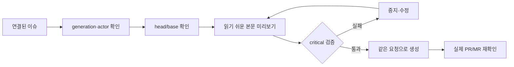

# IssueOps Create PR

이 스킬은 **연결된 IssueOps cycle의 PR/MR 하나를 publish하는 단계**다.
Issue와 child는 [`issueops-create-issue`](../issueops-create-issue/SKILL.md)가
만든다. 전체 lifecycle은 [`issueops`](../issueops/SKILL.md)가 소유한다.

publish는 완료가 아니다. 이 스킬이 만드는 것은 draft이며, 그 draft를 근거로
완료 증거를 봉인하고 generation을 반납하는 단계는
[`issueops-complete`](../issueops-complete/SKILL.md)가 소유한다.

GitHub의 PR과 GitLab의 MR은 같은 publication 계약을 쓴다. CLI의 canonical
동사는 `remote create-pr`이며, 별도의 `create-mr` alias는 만들지 않는다.

원격 쓰기 절차(골격 받기, fluent-korean, preview의 가독성 판정 → 동일 요청 confirm → readback,
모호할 때의 reconcile)는 [`issueops-remote-write`](../issueops-remote-write/SKILL.md)가
소유한다. provider별 링크·계층 규칙은
[`remote-issue.md`](../issueops/references/remote-issue.md)가 소유한다.

직전 단계는 [`issueops-verify`](../issueops-verify/SKILL.md)와 8단계 커밋·푸시다.

## 읽는 순서

리뷰어가 처음 보는 순서를 고정한다. 필수 절은 네 개다.

1. **요약**: 무엇을 왜 바꿨는지와 그 결과 무엇이 달라지는지. 봉인 intent 문서
   (`<artifact_dir>/intent.md`, 없으면 `status --json`의 `.intent`)의 해석과 성공 기준에서
   옮겨 쓴다. 새로 짓지 않는다. 마지막 줄에 `Closes #n`을 둔다
2. **변경 내용**: 무엇이 바뀌었는지, 무엇은 안 바뀌었는지
3. **확인한 것**: 확인한 동작, 방법, 결과. 확인하지 못한 것은 따로
4. **리뷰 포인트**: 판단이 필요한 곳과 원하는 피드백

대안과 선택 이유, 위험과 되돌리기, 호환성과 마이그레이션, 남은 일은 쓸 내용이 있을
때만 둔다. 같은 내용을 여러 절에 복사하지 않는다. 작은 변경에 큰 다이어그램을 넣지
않는다. PR과 MR은 provider만 다르고 읽는 순서는 같다.

## 흐름



## 시작 게이트

```bash
issueops next --id "$ISSUEOPS_ID" --json
```

`stage.key`가 `pr.create`면 이 스킬이다. 8단계 커밋·푸시가 끝나 있어야 한다 — 아직이면
`next`가 `commit-push`를 가리킨다.

다음 하나라도 없으면 이 스킬을 실행하지 않는다.

- record의 canonical `issue_url`과 issue phase evidence
- current `Execution`의 generation, mode, canonical worktree, native holder
- 현재 branch와 일치하는 `head`, sealed target과 일치하는 `base`
- provider/auth, project authority, label/assignee
- native host, session, process, cwd identity
- 봉인된 `project_docs_review` 판정과, 스키마 변경이 있다면 `schema_evidence`

`project_docs_review`·`schema_evidence`가 없거나 `_stale`로 뜨면 PR을 만들지
말고 [`issueops-implement`](../issueops-implement/SKILL.md)의 publication
evidence gates로 돌아간다. stale은 봉인 이후 diff가 바뀌었다는 뜻이므로,
문서를 다시 대조하고 최신 fingerprint로 재기록해야 한다.

`expected-generation`은 현재 lease와 같아야 한다. branch를 새로 만들거나
moving default branch를 추측하지 않는다. label score의 선택/거절과 threshold는
본문이 아니라 `issueops decision add --kind review --title "라벨 판단"`으로 record에 남긴다.

## Body 형식

골격은 `issueops remote render-template --kind pr --template pull_request`가 출력한다.
절을 채우는 방법, 용어 변환표, 공개 모범 사례, 가독성 검사 기준은
[`references/readable-body.md`](../issueops-remote-write/references/readable-body.md)가
소유한다. 이 스킬에 절 목록이나 본문 예시를 따로 두지 않는다.

body 초안을 만든 다음, `remote create-pr`을 실행하기 전에 `fluent-korean`
스킬을 Skill 도구로 호출해서 문장을 다듬는다. 가독성 검사는 문장이 자연스러운지
판정하지 않으므로 AI가 쓴 티는 걸러지지 않는다. 이 호출을 건너뛴 body로는
`--confirm`을 붙이지 않는다. 해시, 커밋 SHA 전문, 로컬 경로, plan 원문은 본문에
넣지 않는다. 검증 항목 원장과 계획은 `.issueops/issues/<n>/`에 있다.

### 나쁜 예

| 나쁜 입력 | 문제 |
|---|---|
| `테스트 완료` | 무엇을 어떻게 확인했는지 없다 |
| 확인한 것 절에 `pass`만 적은 표 | 결과만 있고 확인한 동작이 없다 |
| 계획 원문이나 게이트 원장을 본문에 붙임 | 리뷰어가 흐름을 찾지 못한다. 자료는 `.issueops/issues/<n>/`에 있다 |
| 파일 30개 나열 | 변경 이유·경계·리뷰 포인트가 보이지 않는다 |
| 요약에 `Closes #n` 없음 | publication이 어느 작업인지 연결되지 않는다 |
| `gh pr create` / `glab mr create` 직접 실행 | IssueOps lease와 readback을 우회한다 |
| `head=main`, `base=feature/*` | 방향이 뒤집혔거나 moving ref를 추측한다 |
| timeout 뒤 create-pr 재실행 | duplicate PR/MR 위험이 있다 |
| 긴 로그와 token 첨부 | durable body에 secret이 남는다 |

## Canonical publication

body file을 먼저 작성하고, 다음 명령은 preview로 실행한다. `--confirm` 없는
경로는 provider mutation을 하지 않는다. 응답의 `readability.critical`이 비어 있어야
confirm이 통과한다. `--template`을 생략하면 `pull_request`가 쓰인다.

```bash
issueops remote create-pr \
  --id "$ISSUEOPS_ID" --expected-generation "$GENERATION" \
  --provider "$PROVIDER" --title "[refactor] IssueOps publication 경계를 분리한다" \
  --head "$HEAD_BRANCH" --base "$BASE_BRANCH" \
  --template pull_request --body-file "$BODY_FILE" \
  --label enhancement --assignee "$ASSIGNEE" \
  --host "$HOST" --session-id "$SESSION_ID" --agent-id "$AGENT_ID" \
  --session-pid "$SESSION_PID" --session-started-at "$SESSION_STARTED_AT" \
  --session-executable "$SESSION_EXECUTABLE" --cwd "$WORKER_PATH" --json
```

preview와 같은 명령에만 `--confirm`을 추가한다. 성공 후
`remote verify-artifact`와 provider readback으로 URL, source/target branch,
Issue linkage, labels, assignee, body를 확인한다.

```bash
issueops remote verify-artifact \
  --id "$ISSUEOPS_ID" --provider "$PROVIDER" --kind "$ARTIFACT_KIND" \
  --url "$PR_OR_MR_URL" --target-branch "$BASE_BRANCH" \
  --label enhancement --assignee "$ASSIGNEE" --json
```

`ARTIFACT_KIND`는 GitHub에서 `pr`, GitLab에서 `mr`이다. 생성 command 이름과
검증 artifact kind를 혼동하지 않는다.

provider 결과가 불명확하면 create를 반복하지 않는다. execution의 reconcile
경로에서 후보를 검증한 뒤 하나만 연결한다.

## 품질·성능 게이트

- 품질: linked Issue, generation-CAS, head/base, actor, `readability.critical` 0과 warning 처리,
  원격 write 전 `fluent-korean` 호출, label/assignee, live artifact readback,
  secret redaction.
- 성능: publication 단계에서 issue creation과 전체 lifecycle reference를
  중복 로드하지 않는다. 변경 전후 byte 수와 focused 검증 시간을 기록할 수
  있지만 측정 없는 latency 개선 주장은 하지 않는다.
- 검증:

```bash
python3 scripts/validate-skill.py skills/issueops-create-pr
python3 scripts/verify-skill-shell.py skills/issueops-create-pr
wc -c skills/issueops-create-pr/SKILL.md
```

linked Issue, lease, branch pair, owner identity, body validation, provider
authority, label/assignee, 또는 live readback이 모호하면 publish하지 않는다.
