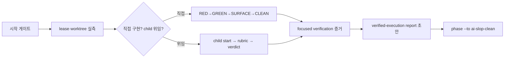

# IssueOps Implement

이 스킬의 일은 **implement 단계 하나**다. 승인된 plan을 canonical worktree에서
TDD로 구현하고, execution lease를 지키고, 증거를 남기고, ai-slop-clean 단계로
넘긴다. 다음 단계는 공용 라우터로 이어가며, 승인된 종료점 전에는 완료 응답으로 끊지 않는다.

- 전체 흐름과 phase 라우팅: [`issueops`](../issueops/SKILL.md)
- 브랜치 정체성 준비: [`issueops-prepare`](../issueops-prepare/SKILL.md)
- lease 준비·회복 체인 전문: [`execution.md`](../issueops/references/execution.md)
- 게이트 원장: [`gates-ledger`](../gates-ledger/SKILL.md)
- 다음 단계: [`issueops-clean`](../issueops-clean/SKILL.md)
- delegated child 전문: [`orchestration.md`](../issueops/references/orchestration.md)
- PR/MR publication: [`issueops-create-pr`](../issueops-create-pr/SKILL.md)

## 흐름



## 시작 게이트

```bash
issueops next --id "$ISSUEOPS_ID" --json
```

`stage.key`가 `implement.enter`나 `implement`면 이 스킬이다.

- `claim`이면 이 세션이 Orca가 띄운 구현 세션인지 확인한다. 맞으면 자기 프롬프트의
  봉인된 `execution claim --claim-current-token` 명령을 정확히 한 번 실행하고 `next`를
  다시 돌린다. 아니면 `next_command`가 돌려주는 회복 체인을 따른다.
- `plan.*`이면 [`issueops-plan`](../issueops-plan/SKILL.md)이, `clean`이면
  [`issueops-clean`](../issueops-clean/SKILL.md)이 맞다.
- `none`이면 사이클이 아직 없다. [`issueops-create-issue`](../issueops-create-issue/SKILL.md)로
  시작한다. 상태만 보고하고 "진행 방향은 사용자 결정"으로 멈추는 것은 게이트 통과가
  아니라 라우팅 누락이다.

진행하기 전에 편집 대상이 맞는지 실측한다.

```bash
issueops execution whoami --json
git -C "$WORKTREE" rev-parse --abbrev-ref HEAD
git -C "$WORKTREE" status --porcelain
```

holder가 이 세션이 아니거나 generation이 다르면 구현하지 않고 아래 회복 표를 따른다.
worktree의 branch·HEAD가 record와 다르거나 무관한 dirty 변경이 있으면 멈춘다.

이 실측 뒤, 아래 진입 절차 전에 [`issueops`](../issueops/SKILL.md)의 **한 번의 실행 방식
선택**이 있었는지 확인한다. 현재 세션·새 세션 중 하나를 선택한 기록과 승인 범위가 있으면
다시 묻지 않는다. 새 세션은 인계문과 `status`의 실제 결정을 대조하고 자기 lease로
인수한 뒤 이어간다. 보류는 구현 승인이 아니다. 아직 선택하지 않았다면 공용 라우터가 묻는다.

## 진입 절차

`stage.key`가 `implement.enter`면 아래를 순서대로 실행한다. Orca 세션이든 direct
세션이든 같다.

```bash
# prepare가 스테이징한 계획을 워크트리에 풀어 두고 plan_path를 채웠으면 생략한다.
issueops link-plan --id "$ISSUEOPS_ID" --plan-path "$WORKTREE_PLAN" \
  $RECORD_ACTOR_FLAGS --json

issueops compatibility review --id "$ISSUEOPS_ID" \
  --backward-compatibility "<기존 호출자에게 무엇이 그대로인가>" \
  --side-effect "<파일·원격·상태에 남는 변화>" --rollback-plan "<되돌리는 방법>" \
  --verification "<무엇으로 확인하는가>" --approved $RECORD_ACTOR_FLAGS --json

# 계획의 수용 기준을 게이트 원장 파일로 만든다(gates-ledger).
issueops gates init --file "$WORKTREE/.issueops/issues/$ISSUE/gates.md" --scope "$ISSUE" \
  --gate "G1: <결과> | CHECK: <명령> | EXPECT: <문자열>" --json

issueops phase --id "$ISSUEOPS_ID" --to implement $RECORD_ACTOR_FLAGS --json
```

blocker가 하나라도 있으면 compatibility review는 승인되지 않는다. blocker를 먼저 없앤다.

## 구현 루프

- behavior change는 focused failing test에서 시작한다:
  RED→GREEN→SURFACE→CLEAN. RED에서 새 테스트가 곧바로 통과하면 버그 이해가
  틀린 것이므로 수정에 착수하지 않고 보고한다.
- 파일 수정은 canonical worktree 안에서만 한다. source checkout 수정은 변경
  규모와 무관하게 계약 위반이다. worktree는 이미 준비되어 있으므로 "시간이
  없다"는 source checkout 작업의 근거가 되지 않는다.
- 검증은 변경 범위에 집중한 명령을 실행하고 명령과 결과를 그대로 기록한다.
  실행하지 않은 검증을 `pass`로 적지 않는다.
- commit·push는 승인된 종료점에 포함되어 있으면 [`atomic-commit-push`](../atomic-commit-push/SKILL.md)로
  이어간다. 실행 방식 선택에서 허용된 issue branch의 publication을 다시 묻지 않는다.
- API/DTO/OpenAPI 변경은 `.issueops/OPEN_API_SPEC.md` gate를 적용한다.
- RED/GREEN 증거는 [`gates-ledger`](../gates-ledger/SKILL.md)로
  `.issueops/issues/<n>/gates.md`에 `gates check --write`로 채운다.

기존 코드베이스를 존중하는 네 규칙이다. 계획이 이미 정한 것을 구현에서 다시 뒤집지
않기 위한 것이다.

1. **재사용을 먼저 본다.** 기존 함수·패키지·테스트 헬퍼를 확장하는 쪽이 새 파일·새
   추상화보다 앞선다. 계획의 `## 재사용하는 기존 구현`에 없는 새 추상화는 만들지 않는다.
2. **계약 표면은 이슈와 계획이 명시한 것만 바꾼다.** CLI JSON, MCP schema, golden,
   record schema, provider body 계약이 여기 해당한다. 하위 호환이 깨지는 변경은 계획에
   적힌 것만 한다.
3. **hot path를 건드리면 전후를 측정한다.** 측정값을 evidence로 남긴다. 측정 없이
   성능이 나아졌다고 적지 않는다.
4. **side effect를 목록으로 적는다.** 파일·원격·durable state에 남는 변화를 verified-execution
   report에 적는다.

## Lease fencing

durable mutation(phase 전이, record 기록, artifact stage) 전마다 exact lifecycle
ID·generation·native actor·canonical cwd를 현재 record와 대조한다. 이 불변식은 라우터
[`issueops`](../issueops/SKILL.md)의 `## 공통 불변식`이 소유한다.

불일치는 stop이다. 사용자의 "그 세션은 내가 껐어"는 quiescence 증거가 아니다.

## 회복은 next_command 체인만

lease가 없거나, holder가 다르거나, mutation 결과가 모호할 때는 아래 첫 명령을
실행하고 **각 결과가 돌려주는 `next_command`를 그대로 실행한다**.

| 상황 | 첫 명령 |
|---|---|
| 방향을 모르겠다 | `execution status --id ID --json` |
| holder 교체·회수가 필요하다 | [`issueops-abandon`](../issueops-abandon/SKILL.md)의 인수 경로를 따른다 |
| provisioning·publication 결과가 모호하다 | `execution reconcile --id ID --preview` 후 `--confirm` |

- `--revoke`·`--finalize`·`--reseed`와 fingerprint를 기억으로 조합하지 않는다.
  preview가 돌려준 정확한 명령만 실행한다.
- direct 회복의 종착은 `claim`, orca 회복의 종착은 `resume`이다. 서로 바꿔
  추정하지 않는다.
- 모호한 mutation 뒤에 같은 prepare/create를 반복 실행하지 않는다. 파일시스템을
  직접 관찰해서 "흔적이 없으니 재실행"으로 분기하지도 않는다. 처분은
  reconcile이 소유한다.
- 전체 replacement 체인과 legacy 예외는 [`execution.md`](../issueops/references/execution.md)가
  소유한다. 이 표는 진입점만 제공한다.

## Child 위임

원격 parent/child 분리는 [`issueops-create-issue`](../issueops-create-issue/SKILL.md)가
소유한다. 실행 중 만드는 delegated child cycle은 그것과 별개다.

세 조건이 모두 참일 때만 위임한다: parent가 implement phase다, 세 리뷰 게이트가
approved 또는 waive다, plan이 sub-agent pattern·scope·acceptance·verification·
fallback·tradeoff를 기록한다.

```bash
issueops child start --parent "$ISSUEOPS_ID" \
  --branch "$CHILD_BRANCH" --title "$TITLE" \
  --scope "$SCOPE" --acceptance "$CRITERION" \
  --host claude --session-id "$SESSION_ID" --cwd "$WORKER_PATH" --json
issueops child status --parent "$ISSUEOPS_ID" \
  --host claude --session-id "$SESSION_ID" --cwd "$WORKER_PATH" --json
```

- verdict는 `accept`·`reject`·`drop` 셋뿐이다. child scope를 고치는 amend 명령은
  없으므로 찾거나 발명하지 않는다.
- child의 branch·worktree·lease는 child cycle 자신의 `branch prepare`와
  `execution prepare`가 소유한다. worktree provisioning은 `execution prepare`
  몫이며, legacy `worktree prepare` 계열 명령은 v1 카탈로그에서 제거되었다.
  parent가 child worktree를 직접 만들거나 `orca worktree create`로 대체하지
  않는다.
- child가 scope drift를 보고하면 child를 조용히 넓히지 않는다. 사용자가
  승인해도 경로는 두 가지뿐이다: 새 scope를 **새 child**로 분리하거나, plan을
  개정하고 plan hash에 묶인 리뷰 freshness를 다시 확인한다.
- accept 전 rubric: 위임한 scope·expected worktree 준수, acceptance별 증거,
  선언한 검증 명령의 실행 결과, 무관한 diff·secret·stale scaffold 없음. 하나라도
  모호하면 accept하지 않는다.
- parent는 child record를 대신 수정하지 않는다. child contract prompt 템플릿과
  상세 rubric은 [`orchestration.md`](../issueops/references/orchestration.md)를 따른다.

## 종료 게이트

implement 단계의 출구는 ai-slop-clean 전이다.

1. focused verification 증거가 명령·결과로 남아 있고, 위임한 child가 전부 accepted
   또는 dropped다. `child_incomplete`·`child_unvalidated`가 남으면 전이가 거부된다.
2. verified-execution report 초안을 워크트리 **안**에 쓴다. 경로는
   [`issueops-complete`](../issueops-complete/SKILL.md)가 요구하는 워크트리 내부 상대
   경로다. 최종 확정은 5단계 정리가 한다.
3. `issueops phase --id ID --to ai-slop-clean $RECORD_ACTOR_FLAGS --json`
   으로 전이한다. 다음은 [`issueops-clean`](../issueops-clean/SKILL.md)이다.
4. 이 단계에서는 커밋·푸시하지 않는다. 커밋은 8단계다.

`execution complete`는 이 단계의 명령이 아니다. complete는 pr phase에서 검증된 remote
artifact URL·final head·verified-execution report를 요구하며 그 전 호출은 거부된다. "구현 끝났으니
완료 처리해줘"가 뜻하는 것은 phase 전이지 complete가 아니다.

## 나쁜 예

| 나쁜 행동 | 문제 |
|---|---|
| `next`를 돌리지 않고 phase를 추정 | 단계 판별은 CLI가 소유한다. 추정한 phase로 시작하면 게이트가 뒤에서 막는다 |
| "3줄 수정이니까" source checkout에서 바로 수정 | canonical worktree 계약 위반, 이후 readiness의 head 증거와 어긋난다 |
| 사용자 구두 확인만으로 `replace --revoke --confirm` | quiescence 증명이 없다. finalize-preview 결과만 증거다 |
| direct인데 `resume`, orca인데 수동 `claim` 조합 | 모드별 종착 명령을 혼동했다. next_command를 따른다 |
| timeout 뒤 prepare/create 재실행 | 이중 mutation 위험이 있다. 처분은 reconcile이 소유한다 |
| 구현 직후 커밋·푸시 | 커밋은 8단계다. 정리·문서·검증이 봉인을 바꾸므로 지금 커밋하면 다시 커밋해야 한다 |
| 이 스킬 안에서 ai-slop-clean 기록이나 구현 리뷰 기록 | 5·7단계가 소유한다. 여기서 기록하면 그 뒤의 변경이 전부 stale이 된다 |
| 운영 DB에 `SELECT COUNT(*)` 전수 스캔으로 row 수 측정 | 커넥션을 소모한다. 카탈로그 추정치를 쓴다 |
| 실측 없이 "일반적으로 인덱스가 필요하다"로 schema evidence 기록 | source 없는 수치는 추정이다. 관찰 불가면 waive에 근거를 적는다 |
| implement 직후 `execution complete` | complete는 pr phase에서 remote artifact 검증 후에만 가능하다 |
| 구두 승인으로 child scope 확장 | sanctioned 경로는 새 child 분리 또는 plan 개정뿐이다 |
| 존재가 불확실한 서브커맨드를 --help 프로브로 확정 | 이 CLI의 --help 프로브는 신뢰할 수 없다. usage 카탈로그와 소스가 기준이다 |

## 검증

```bash
python3 scripts/validate-skill.py skills/issueops-implement
python3 scripts/verify-skill-shell.py skills/issueops-implement
wc -c skills/issueops-implement/SKILL.md
```

시작 게이트·lease·child verdict·리뷰 게이트·종료 게이트 중 하나라도 모호하면
durable mutation을 하지 않고 현재 상태와 막힌 지점을 보고한다.
