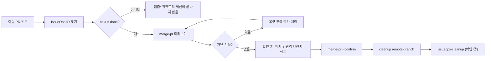

# IssueOps Merge

이 스킬은 **완료된 사이클의 PR/MR 하나를 머지하고 정리 단계로 넘기는 일**을 맡는다.
워크트리 세션이 `execution complete`까지 끝낸 뒤, 개발자가 PR을 확인하고 메인
세션에서 부르는 단계다.

- 전체 흐름과 단계 판별: [`issueops`](../issueops/SKILL.md)
- 직전 단계: [`issueops-complete`](../issueops-complete/SKILL.md)
- 다음 단계: [`issueops-cleanup`](../issueops-cleanup/SKILL.md)
- 원격 쓰기 절차: [`issueops-remote-write`](../issueops-remote-write/SKILL.md)

이 스킬이 하지 않는 일은 다음과 같다.

- `execution complete`를 대신 기록하지 않는다. 워크트리 세션의 몫이다.
- 코드를 고치지 않는다. 고칠 일이 생기면 사이클을 다시 열어 워크트리 세션에 넘긴다.
- 워크트리·로컬 브랜치 삭제와 이슈 종료는 `issueops-cleanup`이 맡는다.
- `gh pr merge`, `glab mr merge`, `--admin`, 자동 머지를 직접 쓰지 않는다.

## 흐름



## 1 대상 찾기

사용자가 이슈 번호나 PR 번호를 준다. `issueops list`의 `issue_url`과
`remote_artifact_url`에서 번호가 맞는 사이클을 고른다.

```bash
issueops list --repo "$PWD" --json
```

- 이슈 번호는 `issue_url`의 `/issues/<n>`과 맞춘다.
- PR 번호는 `remote_artifact_url`의 `/pull/<n>`(GitHub)이나
  `/merge_requests/<n>`(GitLab)과 맞춘다.
- 맞는 사이클이 없거나 둘 이상이면 후보를 보여 주고 사용자에게 묻는다. 제목으로 추측하지 않는다.

## 2 진입 게이트

```bash
issueops next --id "$ISSUEOPS_ID" --json
```

`stage.key`가 `done`이어야 한다. `pr.create`나 `pr.complete`, 또는 lease가 active인
상태라면 워크트리 세션이 아직 끝나지 않은 것이다. 이때는 멈추고 그 사실을 보고한다.
살아 있는 홀더의 lease를 가져오지 않는다.

## 3 미리보기

```bash
issueops remote merge-pr --id "$ISSUEOPS_ID" --json
```

기본 방식은 `squash`다. 사용자가 다른 방식을 원할 때만 `--method merge` 또는
`--method rebase`를 붙인다. GitLab은 프로젝트 설정이 merge commit과 fast-forward를
정하므로 `rebase`를 받지 않는다.

응답에서 다음 값을 사용자에게 보여 준다.

| 항목 | 필드 |
|---|---|
| PR/MR | `url`, `state`, `draft`, `base_branch` |
| 체크 | `checks`, `failing_checks`, `pending_checks` |
| head | `head_oid`와 `expected_head_oid`(completion이 봉인한 head) |
| 차단 사유 | `blockers[].code`, `blockers[].message` |

`ok: true`이고 `blockers`가 비어 있으면 4단계로 간다. `already_merged: true`면 이미
머지된 것이므로 5단계로 간다.

## 차단 사유별 복구

`merge-pr`는 차단 사유가 하나라도 있으면 `--confirm`을 거부하고 아무것도 바꾸지 않는다.
사유마다 되돌아갈 길이 정해져 있다.

| code | 뜻 | 복구 |
|---|---|---|
| `checks_pending` | CI가 아직 돈다 | 기다린 뒤 3단계 미리보기를 다시 실행한다. 상태는 바뀌지 않는다 |
| `checks_failing` | CI가 실패했다 | 아래 두 갈래 중 하나를 사용자와 정한다 |
| `head_mismatch` | completion 뒤에 커밋이 더 올라갔다 | 검증되지 않은 head다. 사이클을 다시 연다 |
| `merge_conflict` | base와 충돌한다 | base를 먼저 동기화한 뒤 사이클을 다시 연다 |
| `merge_blocked` | 리뷰 승인이나 브랜치 보호가 막는다 | 사람이 provider에서 해결한 뒤 미리보기를 다시 실행한다. `--admin`으로 우회하지 않는다 |
| `pr_not_open` | PR/MR이 닫혔다 | 멈춘다. 폐기할지는 사용자가 정하고 [`issueops-abandon`](../issueops-abandon/SKILL.md)이 맡는다 |

### 체크 실패의 두 갈래

**일시적 실패**(네트워크, runner 오류처럼 코드와 무관한 실패)라면 사용자 승인을 받고
실패한 job만 다시 돌린 뒤 미리보기를 다시 실행한다. GitHub에서는
`gh run rerun <run-id> --failed`를 쓰고, GitLab에서는 provider 화면에서 실패한 job을
다시 실행한다.

**코드 결함**이라면 사이클을 다시 연다. 같은 브랜치와 같은 PR을 그대로 쓴다.

```bash
issueops execution status --id "$ISSUEOPS_ID" --json
issueops execution replace --id "$ISSUEOPS_ID" --expected-generation "$GENERATION" --preview $ACTOR_FLAGS --json
```

`$ACTOR_FLAGS`는 `issueops execution whoami --json`이 돌려준 값을 쓰고, 소스 체크아웃에서
실행한다. `replace --preview`가 돌려준 `--reseed` 명령을 그대로 실행한다. reseed는 완료된
generation을 기록에 보관하고 phase를 `implement`로 되돌리며 lease를 claimable로 만든다.
보관된 PR 연결은 그대로 남는다. 이어서 워크트리 세션에 결과의 claim 명령을 넘기고,
그 세션이 `issueops next`를 따라 구현부터 `execution complete`까지 다시 진행한다.
완료가 다시 기록되면 이 스킬의 1단계부터 다시 시작한다.

- `--expected-generation`과 fingerprint는 기억으로 채우지 않는다. `execution status`와
  preview가 돌려준 값만 쓴다.
- base가 앞서 나가 있으면 preview가 base 동기화를 먼저 요구하며 `sync-base` 명령을 돌려준다.
  그 명령을 실행한 뒤 preview를 다시 받는다.
- reseed는 완료된 실행을 복구하는 경로다. 평소 세션 인계에 쓰지 않는다.

### 충돌과 head 불일치

`merge_conflict`면 reseed보다 base 동기화가 먼저다. 완료된 사이클에서도 동기화할 수 있다.

```bash
issueops execution sync-base --id "$ISSUEOPS_ID" --completion-generation "$COMPLETION_GENERATION" --preview $ACTOR_FLAGS --json
```

`$ACTOR_FLAGS`는 `issueops execution whoami --json`이 돌려준 값을 쓴다. 동기화가 PR head를
옮기므로 그 뒤의 미리보기는 `head_mismatch`를 보고한다. 그때 위의 reseed 경로로
사이클을 다시 열어 검증과 완료를 새 head로 다시 받는다.

## 4 확인 경계

차단 사유가 없을 때 한 번의 확인으로 머지와 원격 브랜치 삭제를 함께 받는다.

```text
PR <URL>(head <head_oid 앞 10자>, 체크 <checks>)을
<draft면 "draft에서 해제하고 "><method> 방식으로 <base_branch>에 머지하고,
머지 뒤 원격 브랜치 <branch>(OID <head_oid 앞 10자>)를 삭제할까요?
워크트리·로컬 브랜치 정리와 이슈 종료는 다음 단계에서 따로 확인합니다.
```

가장 최근 사용자 메시지가 이 대상을 확인해야 한다. 일반적인 "머지해" 요청은 미리보기까지만
허락한 것으로 본다.

## 5 머지

```bash
issueops remote merge-pr --id "$ISSUEOPS_ID" --method squash --confirm --json
```

미리보기와 같은 `--method`를 쓴다. `ok: true`, `merged: true`를 요구한다. `marked_ready`는
draft를 해제했는지, `merge_commit_oid`는 base에 생긴 커밋을 알려 준다.

- 명령이 `merge-pr refused`로 끝나면 그 사이 상태가 바뀐 것이다. 3단계로 돌아간다.
- `merge was not verified`로 끝나면 머지가 대기열에 들어갔거나 provider가 아직
  반영하지 않은 것이다. 같은 명령을 반복하지 말고 잠시 뒤 미리보기로 상태를 읽는다.
  `already_merged: true`가 나오면 성공으로 이어 간다.

## 6 원격 브랜치 삭제

```bash
issueops cleanup remote-branch --id "$ISSUEOPS_ID" --preview --json
```

미리보기의 `branch`와 `remote_oid`가 4단계에서 확인받은 브랜치·OID와 같아야 한다.
다르면 멈추고 새 대상으로 다시 확인받는다. 같으면 미리보기가 돌려준 `next_command`를
그대로 실행한다. 형식은 다음과 같다.

```text
issueops cleanup remote-branch --id "$ISSUEOPS_ID" --apply --confirm --fingerprint "$FINGERPRINT" --json
```

`deleted: true` 또는 `already_absent: true`를 요구한다. `git push origin --delete`를
직접 쓰지 않는다.

## 7 정리로 넘기기

[`issueops-cleanup`](../issueops-cleanup/SKILL.md)을 같은 ID로 이어서 실행한다. cleanup은
워크트리·로컬 브랜치 삭제와 이슈 종료를 위해 자체 미리보기와 확인 ②를 따로 받는다.
원격 브랜치는 6단계에서 지웠으므로 `--keep-remote-branch`는 쓰지 않는다.

## 완료 보고

| 항목 | 근거 |
|---|---|
| 사이클 | IssueOps ID, 이슈 URL |
| 머지 | PR/MR URL, 방식, `merge_commit_oid`, draft 해제 여부 |
| 원격 브랜치 | `cleanup remote-branch`의 `deleted` 또는 `already_absent` |
| 다음 단계 | `issueops-cleanup` 진행 결과 또는 대기 중인 확인 |
| 복구 | 차단 사유가 있었다면 code와 선택한 복구 경로 |

## 나쁜 예

| 나쁜 행동 | 문제 |
|---|---|
| `gh pr merge --squash --delete-branch` 직접 실행 | head 고정과 머지 확인이 빠진다. 다른 워크트리가 base를 체크아웃하고 있으면 로컬 정리 단계에서 실패한다 |
| `checks_failing`인데 `--admin`이나 자동 머지로 넘김 | 실패한 코드가 base에 들어간다 |
| `head_mismatch`를 무시하고 머지 | completion이 검증하지 않은 커밋이 들어간다 |
| 체크 실패를 메인 세션에서 직접 고쳐 push | lease 없이 사이클 브랜치를 바꾼다. reseed로 워크트리 세션에 넘긴다 |
| `stage.key`가 `pr.complete`인데 머지 | completion이 없어 `merge-pr`가 거부한다. 워크트리 세션을 기다린다 |
| `merge was not verified` 뒤 confirm 반복 | 대기열에 들어간 머지를 두 번 요청한다. 미리보기로 상태를 읽는다 |
| 원격 브랜치를 `git push origin --delete`로 삭제 | fingerprint와 감사 기록을 우회한다 |
| 머지 확인 하나로 워크트리와 이슈까지 정리 | cleanup의 fingerprint는 이슈를 닫은 뒤 새로 발급된다. 확인 ②를 따로 받는다 |

## 검증

```bash
python3 scripts/validate-skill.py skills/issueops-merge
python3 scripts/verify-skill-shell.py skills/issueops-merge
```
