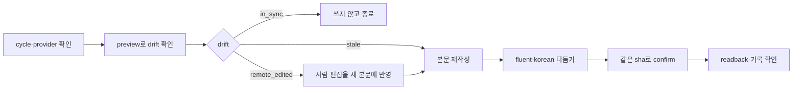

# IssueOps Sync Issue

이 스킬의 일은 **이미 만든 Issue의 본문을 지금 사이클에 맞게 다시 쓰는 것**이다.
새 Issue를 만들거나, 계획을 세우거나, 구현하지 않는다.

- 새 Issue·child 생성: [`issueops-create-issue`](../issueops-create-issue/SKILL.md)
- PR/MR 본문 최신화: [`issueops-sync-pr`](../issueops-sync-pr/SKILL.md)
- 전체 흐름: [`issueops`](../issueops/SKILL.md)
- 원격 쓰기 절차: [`issueops-remote-write`](../issueops-remote-write/SKILL.md)
- provider 세부 규칙: [`remote-issue.md`](../issueops/references/remote-issue.md)

시작 전 `issueops next --id "$ISSUEOPS_ID" --json`으로 현재 단계를
확인한다. 본문 동기화는 어느 단계에서든 할 수 있지만, `next`가 가리키는 단계의 일을
미루는 대신 하는 것이 아니다.

## 언제 쓰는가

Issue 본문은 만든 시점에 멈춰 있고 사이클은 계속 움직인다. 다음 중 하나가
사실이면 본문이 낡은 것이다.

| 신호 | 본문에서 낡은 부분 |
|---|---|
| child를 새로 만들었거나 닫았다 | `## 하위 Task`의 URL·wave·prerequisite |
| 범위를 좁히거나 넓혔다 | `## 구현 범위`, `## 비목표` |
| 완료 기준이 바뀌었다 | `## 완료 기준` checklist |
| 검증 명령이 바뀌었다 | `## 검증` |
| devil's-advocate·호환성 검토로 방향이 바뀌었다 | `## 위험과 트레이드오프` |

낡았다는 판정을 나이로만 하지 않는다. `sync-issue` preview가 돌려주는
`drift`가 판정의 기준이고, `age_days`는 참고 값이다.

## 흐름



## 시작 게이트

1. `ISSUEOPS_ID`와 `issueops list --repo "$PWD" --json`으로 cycle을
   찾는다. 찾은 record가 상태의 기준이다.
2. record에 canonical `issue_url`이 있어야 한다. 없으면 이 스킬이 아니라
   `issueops-create-issue`가 할 일이다.
3. 원격 본문을 **읽기 전에 새 본문을 확정하지 않는다.** preview가 현재 원격
   본문을 알려주고, 그 위에서 다시 쓴다.
4. child를 대상으로 하려면 그 URL이 현재 parent의 provider-native child여야
   한다. 하네스가 hierarchy를 검증한 뒤에만 쓴다.
5. 관리 블록(`issueops:completion`, `issueops:devils-advocate`,
   `issueops:issue-create`)은 body-file에 넣지 않는다. 하네스가 원격에서
   그대로 떼어내 다시 붙인다. 넣으면 명령이 거부한다.

## drift를 읽는 법

preview는 `--confirm` 없이 실행하며 provider를 변경하지 않는다.

```bash
issueops remote sync-issue \
  --id "$ISSUEOPS_ID" --body-file "$BODY_FILE" --json
```

| `drift` | 뜻 | 다음 행동 |
|---|---|---|
| `in_sync` | 제안 본문이 원격과 같다 | 쓰지 않는다. 최신화할 것이 없다 |
| `stale` | 원격은 하네스가 마지막에 쓴 그대로고, 제안이 앞선다 | 그대로 confirm |
| `remote_edited` | 원격 본문이 하네스 기록과 다르다 | 사람이 손댄 것이다. 아래 절차 |

`expected_body_sha256`은 confirm에 그대로 넘길 값이고, `preserved_sections`는
하네스가 보존할 관리 블록 목록이다.

## 사람이 수정한 본문

`drift`가 `remote_edited`면 누군가 원격에서 직접 고쳤다는 뜻이다. 그 편집을
지우고 덮어쓰지 않는다.

1. 원격 본문을 열어 사람이 추가·수정한 문단을 확인한다.
2. 그 내용을 **새 본문에 반영**한다. 남길 가치가 없다고 판단했다면 왜
   빼는지 사이클 기록에 남긴다.
3. `--accept-remote-edits`를 붙여 그 편집을 확인했음을 명시한다. 이 플래그
   없이는 confirm이 거부된다.

## 읽기 좋은 body

본문 형식은 `issueops remote render-template` 골격과
[`references/readable-body.md`](../issueops-remote-write/references/readable-body.md)를
그대로 따른다. 최신화라고 해서 낡은 문장을 남겨 두고 새 문단만 덧붙이지 않는다.
**본문은 통째로 교체되므로, 지금 사실이 아닌 문장은 지운다.** 옛 형식(`## 문제`로
시작하는 본문)을 동기화할 때는 새 계약의 절로 다시 쓴다.

원격에 쓰기 전에 `fluent-korean` 스킬을 Skill 도구로 호출해서 문장을 다듬는다.
가독성 검사는 문장이 자연스러운지 판정하지 않으므로 번역투와 AI 티는 걸러지지
않는다. 이 호출을 건너뛴 body로는 `--confirm`을 붙이지 않는다.

### 가독성 판정 읽기

preview 응답에는 판정이 두 개 있다.

| 필드 | 대상 | 쓰는 법 |
|---|---|---|
| `readability` | 제안 본문 | critical이 있으면 confirm이 거부된다. 고친 뒤 preview부터 다시 한다. warning은 고치거나 남기는 이유를 적는다 |
| `live_readability` | 원격의 현재 본문 | warning만 담는다. 여기 나온 요약 누락·해시·하네스 용어가 새 본문에서 사라졌는지 확인한다 |

`--template`을 생략하면 제안 본문의 절 제목으로 템플릿을 추론한다(`## 재현 절차` →
bug, `## 제안` → proposal, `--url` child → child_task, 그 밖 → implementation_task).
추론이 의도와 다르면 `--template`을 넘긴다.

### 나쁜 예

| 나쁜 입력 | 왜 나쁜가 | 고치는 방법 |
|---|---|---|
| 새 문단만 아래에 덧붙임 | 본문은 통째로 교체된다. 낡은 문장이 그대로 남는다 | 낡은 문단을 지우고 다시 쓴다 |
| body-file에 완료 기록 블록 포함 | 관리 블록은 하네스가 소유한다 | 빼고 하네스가 재부착하게 둔다 |
| preview 없이 `--confirm` | `--expected-body-sha256`이 없어 거부된다 | preview부터 실행한다 |
| `remote_edited`에 `--accept-remote-edits`만 붙임 | 사람 편집을 확인하지 않고 지운다 | 편집 내용을 새 본문에 반영한 뒤 붙인다 |
| parent record 없이 임의 `--url` | 다른 이슈를 덮어쓸 수 있다 | 현재 parent의 child만 대상으로 한다 |
| `gh issue edit` / `glab api PUT` 직접 실행 | IssueOps readback과 기록을 우회한다 | `remote sync-issue`를 쓴다 |

## Canonical sync

preview → 본문 재작성 → 같은 sha로 confirm 순서를 지킨다.

```bash
issueops remote sync-issue \
  --id "$ISSUEOPS_ID" --provider "$PROVIDER" \
  --template implementation_task --body-file "$BODY_FILE" --json
```

preview가 돌려준 `expected_body_sha256`을 그대로 넘겨 확정한다.

```bash
issueops remote sync-issue \
  --id "$ISSUEOPS_ID" --provider "$PROVIDER" \
  --body-file "$BODY_FILE" \
  --expected-body-sha256 "$EXPECTED_BODY_SHA256" \
  --host "$HOST" --session-id "$SESSION_ID" --cwd "$WORKER_PATH" \
  --confirm --json
```

provider-native child는 `--url`로 지정한다. hierarchy 검증을 통과한 URL만 쓴다.

```bash
issueops remote sync-issue \
  --id "$ISSUEOPS_ID" --url "$CHILD_URL" \
  --body-file "$CHILD_BODY_FILE" \
  --expected-body-sha256 "$EXPECTED_BODY_SHA256" \
  --host "$HOST" --session-id "$SESSION_ID" --cwd "$WORKER_PATH" \
  --confirm --json
```

confirm 결과의 `updated`, `remote_body_sha256`, `preserved_sections`를 확인하고,
관리 블록이 원격 본문에 남아 있는지 readback으로 본다. sha가 어긋나면 원격이
그 사이에 바뀐 것이므로 재실행하지 말고 preview부터 다시 한다.

## 품질·성능 게이트

- 품질: drift 판정 기록, 관리 블록 보존, `readability.critical` 0과 warning 처리,
  원격 write 전 `fluent-korean` 호출,
  compare-and-swap sha 일치, child hierarchy 검증, secret redaction, readback.
- 성능: 최신화 단계에서만 이 스킬을 로드한다. 생성 스킬과 PR reference를
  함께 중복 로드하지 않는다.
- 검증:

```bash
python3 scripts/validate-skill.py skills/issueops-sync-issue
python3 scripts/verify-skill-shell.py skills/issueops-sync-issue
wc -c skills/issueops-sync-issue/SKILL.md
```

provider, 대상 URL, 사람 편집 반영 여부, body 완성도, 또는 관리 블록 보존이
모호하면 쓰지 않는다.
